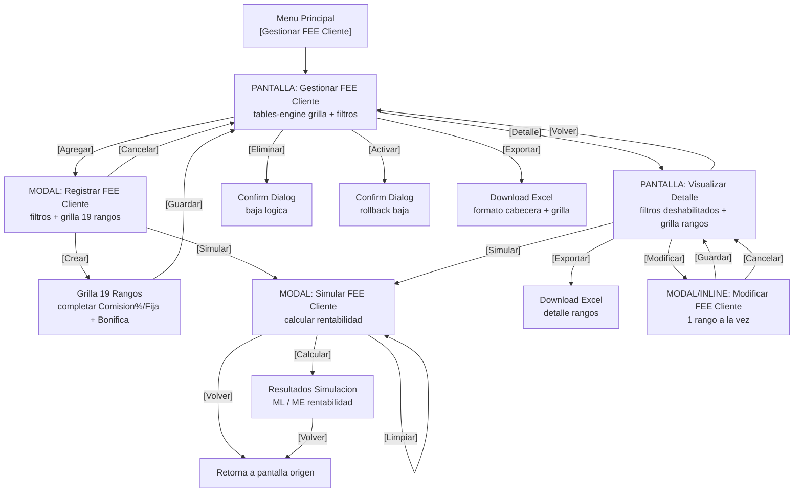

---
tags:
  - modulo-frontend
  - abm
  - fee-cliente
  - m12-03
  - precios
  - casos-de-uso
estado: documentado
sistema: EFS
version: "1.1"
dependencias:
  - M12-02 (Costos Terrapay)
  - M12-04 (FX CIS)
  - M12-05 (Tasas Banco Proveedor)
actor: Comercial
complejidad: alta
tablero: Precios
carpeta_sugerida: src/app/main/prices/fee-cliente
dominio: prices
---

# M12-03 - Gestionar Fee Cliente

**Documento:** EFS - Casos de Uso | Versión 1.1  
**Módulo:** M12-03 - Gestionar Fee Cliente  
**Sistema:** EFS (External Financial System)  
**Dominio:** Precios / Tarifas  
**Actor Principal:** Comercial

---

## Resumen Ejecutivo para IA

> **SCOPE:** Este documento define un módulo ABM (Alta, Baja, Modificación) con funcionalidades adicionales de **simulación financiera**, **histórico de cambios** y **gestión por rangos monetarios**. No es un ABM simple: incluye 19 rangos predefinidos, cálculos de rentabilidad con fórmulas que dependen de otros 3 módulos (M12-02, M12-04, M12-05), y una tabla de auditoría HST_FEECLIENTE.
>
> **TECNICO:** Para replicar este patrón en Angular, usar como base `prices/terrapay-costs`. Se requieren componentes de consulta con `tables-engine`, modales de alta/edición, modal de simulación, y servicios que invoquen APIs de Terrapay y lean tablas de FX CIS y Tasas Banco Proveedor.
>
> **DATOS CLAVE:** 19 rangos fijos (1-50, 51-100... 7001-8000), baja lógica con rollback (campos UsuBaja/FechaBaja + UsuActiva/FechaActiva), histórico con campos INI/FIN.

---

## Índice

- [Mapeo Tecnico Angular](#mapeo-tecnico-angular)
- [Diagrama de Navegacion](#diagrama-de-navegacion)
- [M12 03 - Gestionar FEE Cliente](#m12-03---gestionar-fee-cliente)
- [M12 03.01 - Agregar FEE Cliente](#m12-0301---agregar-fee-cliente)
- [M12 03.02 - Visualizar Detalle FEE Cliente](#m12-0302---visualizar-detalle-fee-cliente)
- [M12 03.02.01 - Modificar FEE Cliente](#m12-030201---modificar-fee-cliente)
- [M12 03.02.02 - Simular FEE Cliente](#m12-030202---simular-fee-cliente)
- [M12 03.02.06 - Exportar Detalle FEE Cliente](#m12-030206---exportar-detalle-fee-cliente)
- [M12 03.03 - Eliminar FEE CLIENTE](#m12-0303---eliminar-fee-cliente)
- [M12 03.04 - Activar FEE Cliente](#m12-0304---activar-fee-cliente)
- [M12 03.06 - Exportar FEE Cliente](#m12-0306---exportar-fee-cliente)
- [Tabla de Rangos Predefinidos](#tabla-de-rangos-predefinidos)
- [Glosario](#glosario)
- [Checklist de Implementacion](#checklist-de-implementacion)
- [Prompt para Replicar](#prompt-para-replicar)

---

## Mapeo Tecnico Angular

Este mapeo relaciona cada caso de uso con los artefactos tecnicos sugeridos, siguiendo el patron del proyecto `CisLatam.CISOrchestrator.UI`.

### Estructura de Carpetas Sugerida

```
src/app/main/prices/fee-cliente/
├── fee-cliente-routing.module.ts
├── fee-cliente.module.ts
├── components/
│   ├── consult/
│   │   └── fee-cliente-consult.component.ts + .html
│   ├── create/
│   │   └── fee-cliente-create.component.ts + .html
│   ├── detail/
│   │   └── fee-cliente-detail.component.ts + .html
│   ├── edit/
│   │   └── fee-cliente-edit.component.ts + .html
│   └── simulate/
│       └── fee-cliente-simulate.component.ts + .html
├── services/
│   └── fee-cliente-api.service.ts
├── config/
│   └── fee-cliente.view-definition.ts
├── shared/
│   ├── models/
│   │   └── fee-cliente.interface.ts
│   └── const/
│       └── fee-cliente.const.ts
```

### Mapeo Caso de Uso → Componente/Servicio

| Caso de Uso | Pantalla | Componente Angular | Metodo API Sugerido |
|-------------|----------|--------------------|---------------------|
| M12 03 | Gestionar FEE Cliente | `consult/fee-cliente-consult` | `getFees(input)` |
| M12 03.01 | Registrar FEE Cliente | `create/fee-cliente-create` | `createOrEdit(input)` |
| M12 03.02 | Visualizar Detalle | `detail/fee-cliente-detail` | `getFeeForEdit(id)` |
| M12 03.02.01 | Modificar | `edit/fee-cliente-edit` (modal desde detail) | `createOrEdit(input)` |
| M12 03.02.02 | Simular | `simulate/fee-cliente-simulate` (modal) | `simulateFee(input)` + API Terrapay |
| M12 03.03 | Eliminar | Confirm dialog en consult | `delete(id)` (baja logica) |
| M12 03.04 | Activar | Confirm dialog en consult | `toggleActive(id, true)` |
| M12 03.02.06 | Exportar Detalle | Boton en detail | `exportToExcel(input)` |
| M12 03.06 | Exportar Grilla | Boton en consult | `exportToExcel(input)` |

### Dependencias de Servicios Cruzados

```
fee-cliente-api.service.ts
    ├── terrapay-api.service.ts          <-- Invocar API Terrapay (simulacion)
    ├── fx-cis-api.service.ts            <-- Leer Tipo Cambio Cliente (M12-04)
    ├── bank-rate-api.service.ts         <-- Leer Tasa Banco Proveedor (M12-05)
    └── terrapay-cost-api.service.ts     <-- Leer Costo Terrapay (M12-02)
```

### Reglas de Negocio Tecnicas

1. **Duplicados:** Validar por llave funcional: `Pais + PaisDestino + TipoTransaccion + Producto + TipoServicio + NombreInstitucion + Canal`
2. **Baja logica:** No borrar fisicamente. Actualizar `IsDeleted`, `UsuBaja`, `FechaBaja`. Los rangos hijos tambien pasan a inactivos.
3. **Activacion:** Revertir estado de baja (`UsuActiva`, `FechaActiva`). Rollback de la eliminacion.
4. **Historico:** Tabla `HST_FEECLIENTE` con campos INI/FIN por cada modificacion.
5. **Rangos:** 19 rangos predefinidos inmutables. Se crean automaticamente al dar de alta el cabecera.
6. **Mutual exclusion:** Comision % y Comision Fija son mutuamente excluyentes (solo uno por rango).

---

## Diagrama de Navegacion



---

## Prototipos de Pantallas

> **Instrucciones para el usuario:** Guarda las 5 imagenes de los prototipos en la carpeta:
> `Proyecto CIS/Documentacion/assets/images/`
> 
> Nombres sugeridos:
> - `M12-03-pantalla-01-gestionar.png`
> - `M12-03-pantalla-02-registrar.png`
> - `M12-03-pantalla-03-detalle.png`
> - `M12-03-pantalla-04-modificar.png`
> - `M12-03-pantalla-05-simular.png`
>
> **Nota para IA:** Si no puedes ver las imagenes, usa las descripciones textuales detalladas debajo de cada placeholder. Cada descripcion incluye el layout completo, campos, botones y datos de ejemplo.

---

### Pantalla 1 - Gestionar FEE Cliente (Consulta)

![[M12-03-pantalla-01-gestionar.png]]

**Descripcion textual detallada (para interpretacion por IA):**

Layout de pagina completa. Titulo superior: **"M12 03 - Presencial - Gestionar Fee Cliente"**. Subtitulo: **"PDP – Prototipos de Pantallas | Version 1.1"**.

**Seccion Superior - Filtros de Busqueda (2 filas de 4 campos cada una):**
| Campo | Tipo | Estado | Valor mostrado |
|-------|------|--------|----------------|
| Pais | Dropdown | Habilitado | "Seleccione una opcion" |
| Pais Destino (Grupo) | Dropdown | Habilitado | "Seleccione una opcion" |
| Tipo Transaccion | Dropdown | Habilitado | "Seleccione una opcion" |
| Producto | Dropdown | Habilitado | "Seleccione una opcion" |
| Tipo Servicio | Dropdown | Habilitado | "Seleccione una opcion" |
| Nombre Institucion | Dropdown | Habilitado | "Seleccione una opcion" |
| Canal | Dropdown | Habilitado | "Seleccione una opcion" |
| Estado | Dropdown | Habilitado | "Seleccione una opcion" |

**Botones debajo de filtros:**
- `[Buscar]` - Azul
- `[Limpiar]` - Azul
- `[Agregar]` - Azul
- `[Exportar]` - Azul

**Seccion Inferior - Grilla de Resultados:**
Tabla con encabezados: Pais | Pais Destino (Grupo) | Tipo Transaccion | Producto | Tipo Servicio | Nombre Institucion | Canal | Estado | Accion

**Datos de ejemplo mostrados (3 filas):**
| Pais | Pais Destino | Tipo Trans | Producto | Tipo Servicio | Nombre Inst | Canal | Estado | Accion |
|------|--------------|------------|----------|---------------|-------------|-------|--------|--------|
| Chile | Grupo Colombia | (vacio) | (vacio) | (vacio) | (vacio) | (vacio) | (vacio) | [Eliminar] [Detalle] |
| Chile | Grupo SEPA | (vacio) | (vacio) | (vacio) | (vacio) | (vacio) | (vacio) | [Eliminar] [Detalle] |
| Bolivia | Grupo Colombia | (vacio) | (vacio) | (vacio) | (vacio) | (vacio) | (vacio) | [Activar] |

Observaciones: La tercera fila (Bolivia) tiene fondo rosa/salmon y el boton dice "Activar" en vez de "Eliminar/Detalle", indicando que esta inactiva/eliminada.

---

### Pantalla 2 - Registrar FEE Cliente (Alta)

![[M12-03-pantalla-02-registrar.png]]

**Descripcion textual detallada (para interpretacion por IA):**

Layout de pagina completa. Titulo superior: **"Registrar Fee Cliente"**.

**Seccion Superior - Filtros de Alta (2 filas):**
| Campo | Tipo | Estado | Valor mostrado |
|-------|------|--------|----------------|
| Pais | Dropdown | Habilitado | "Seleccione una opcion" |
| Pais Destino (Grupo) | Dropdown | Habilitado | "Seleccione una opcion" |
| Tipo Transaccion | Dropdown | Habilitado | "Seleccione una opcion" |
| Producto | Dropdown | Habilitado | "Seleccione una opcion" |
| Tipo Servicio | Dropdown | Habilitado | "Seleccione una opcion" |
| Nombre Institucion | Dropdown | Habilitado | "Seleccione una opcion" |
| Canal | Dropdown | Habilitado | "Seleccione una opcion" |

**Botones debajo de filtros:**
- `[Crear]` - Azul
- `[Cancelar]` - Azul

**Seccion Principal - Grilla de 19 Rangos:**
Tabla con columnas: Monto Desde USD | Monto Hasta USD | Costo Terrapay Fijo | Costo Terrapay % | Mark up | Ganancia CIS Min | Fee Cliente MIN | Comision % | Comision Fija | Bonifica SI/NO | %Bonificacion | Accion

**Datos de ejemplo cargados (algunos rangos completados, otros vacios):**
| Desde | Hasta | Costo Fijo | Costo % | Mark up | Gan CIS Min | Fee Cliente Min | Comision % | Comision Fija | Bonifica | %Bonif | Accion |
|-------|-------|------------|---------|---------|-------------|-----------------|------------|---------------|----------|--------|--------|
| 1 | 50 | (vacio) | 1.1% | 10% | 0.12 USD | 1.32 USD | 25 | (vacio) | SI | 50 | [Simulador] |
| 51 | 100 | 1.2 | (vacio) | 10% | 0.12 USD | 1.32 USD | 2.59% | (vacio) | SI | 30 | (vacio) |
| 101 | 200 | (vacio) | 2.5% | 10% | 0.12 USD | 1.32 USD | 1.31% | (vacio) | (vacio) | (vacio) | (vacio) |
| 201 | 300 | 1.2 | (vacio) | 10% | 0.12 USD | (vacio) | (vacio) | (vacio) | (vacio) | (vacio) | (vacio) |
| 301 | 400 | 1.2 | (vacio) | 10% | (vacio) | (vacio) | (vacio) | (vacio) | (vacio) | (vacio) | (vacio) |
| 401 | 500 | 1.5 | (vacio) | 10% | (vacio) | (vacio) | (vacio) | (vacio) | (vacio) | (vacio) | (vacio) |
| 501 | 600 | 1 | (vacio) | 10% | (vacio) | (vacio) | (vacio) | (vacio) | (vacio) | (vacio) | (vacio) |
| 601 | 700 | (vacio) | 3% | (vacio) | (vacio) | (vacio) | (vacio) | (vacio) | (vacio) | (vacio) | (vacio) |
| 701 | 800 | (vacio) | 3% | (vacio) | (vacio) | (vacio) | (vacio) | (vacio) | (vacio) | (vacio) | (vacio) |
| 801 | 900 | (vacio) | 3% | (vacio) | (vacio) | (vacio) | (vacio) | (vacio) | (vacio) | (vacio) | (vacio) |
| 901 | 1000 | (vacio) | 3% | (vacio) | (vacio) | (vacio) | (vacio) | (vacio) | (vacio) | (vacio) | (vacio) |
| 1001 | 1500 | 1.2 | (vacio) | (vacio) | (vacio) | (vacio) | (vacio) | (vacio) | (vacio) | (vacio) | (vacio) |
| 1501 | 2000 | 2 | (vacio) | (vacio) | (vacio) | (vacio) | (vacio) | (vacio) | (vacio) | (vacio) | (vacio) |
| 2001 | 3000 | 2 | (vacio) | (vacio) | (vacio) | (vacio) | (vacio) | (vacio) | (vacio) | (vacio) | (vacio) |
| 3001 | 4000 | 2 | (vacio) | (vacio) | (vacio) | (vacio) | (vacio) | (vacio) | (vacio) | (vacio) | (vacio) |
| 4001 | 5000 | 1.2 | (vacio) | (vacio) | (vacio) | (vacio) | (vacio) | (vacio) | (vacio) | (vacio) | (vacio) |
| 5001 | 10000 | 5 | (vacio) | (vacio) | (vacio) | (vacio) | (vacio) | (vacio) | (vacio) | (vacio) | (vacio) |
| 10001 | 999999999 | 5 | (vacio) | (vacio) | (vacio) | (vacio) | (vacio) | (vacio) | (vacio) | (vacio) | (vacio) |

Nota: En esta pantalla de alta, los campos Costo Terrapay Fijo/%, Mark up, Ganancia CIS Min y Fee Cliente MIN se muestran precargados o calculados. Los campos editables por el usuario son: Comision %, Comision Fija, Bonifica SI/NO, %Bonificacion. La columna Accion contiene el link "Simulador".

**Botones inferiores:**
- `[Guardar]` - Azul
- `[Cancelar]` - Azul

---

### Pantalla 3 - Visualizar Detalle FEE Cliente

![[M12-03-pantalla-03-detalle.png]]

**Descripcion textual detallada (para interpretacion por IA):**

Layout identico a "Registrar" pero en modo solo lectura. Titulo: **"Visualizar Detalle - Fee Cliente"**.

**Seccion Superior - Filtros (deshabilitados, valores precargados):**
| Campo | Estado | Valor |
|-------|--------|-------|
| Pais | Deshabilitado | "Bolivia" |
| Pais Destino (Grupo) | Deshabilitado | "Grupo Sepa" |
| Tipo Transaccion | Deshabilitado | "P2P" |
| Producto | Deshabilitado | "Terrapay" |
| Tipo Servicio | Deshabilitado | "Wallet" |
| Nombre Institucion | Deshabilitado | "Nequi" |
| Canal | Deshabilitado | "Presencial" |
| Estado | Deshabilitado | "Activo" |

**Botones:**
- `[Volver]` - Azul
- `[Exportar]` - Azul

**Grilla de Rangos:**
Mismas columnas que Registrar. Los datos muestran los mismos valores precargados. Las celdas de la grilla estan deshabilitadas (no editables).

**Acciones por fila:**
- `[Modificar]` - Link azul
- `[Simulador]` - Link azul

Esta pantalla es de solo lectura excepto por los botones de accion por fila que llevan a edicion o simulacion.

---

### Pantalla 4 - Modificar FEE Cliente

![[M12-03-pantalla-04-modificar.png]]

**Descripcion textual detallada (para interpretacion por IA):**

Layout identico a "Visualizar Detalle" pero con la grilla en modo edicion. Titulo: **"Modificar Fee Cliente"**.

**Seccion Superior:**
Igual que Visualizar Detalle: filtros deshabilitados con valores precargados (Bolivia, Grupo Sepa, P2P, Terrapay, Wallet, Nequi, Presencial, Activo).

**Botones superiores:**
- `[Guardar]` - Azul
- `[Cancelar]` - Azul

**Grilla de Rangos (modo edicion):**
Las celdas de la fila seleccionada estan habilitadas para edicion. Se puede modificar:
- Comision %
- Comision Fija
- Bonifica SI/NO
- %Bonificacion

Los demas campos (Costo Terrapay, Mark up, Ganancia CIS Min, Fee Cliente MIN) permanecen calculados y deshabilitados.

**Regla visual:** Solo 1 fila/rango se puede editar a la vez. Las demas filas permanecen deshabilitadas.

**Accion por fila:**
- `[Simulador]` - Link azul (para probar valores antes de guardar)

---

### Pantalla 5 - Simular FEE Cliente

![[M12-03-pantalla-05-simular.png]]

**Descripcion textual detallada (para interpretacion por IA):**

Layout de modal/popup. Titulo: **"Simular FEE Cliente"**.

**Seccion 1: Datos Principales (fila de 4 campos + fila de 3 campos)**
Todos los campos estan deshabilitados (solo lectura), precargados con los valores del registro seleccionado:

| Campo | Valor mostrado |
|-------|----------------|
| Pais | "Bolivia" |
| Pais Destino (Grupo) | "Grupo Sepa" |
| Tipo Transaccion | "P2P" |
| Producto | "Terrapay" |
| Tipo Servicio | "Wallet" |
| Nombre Institucion | "Nequi" |
| Canal | "Presencial" |

**Seccion 2: Datos Rango y Costo Terrapay (fila de campos)**
Campos deshabilitados (solo lectura), precargados del rango seleccionado:

| Campo | Valor |
|-------|-------|
| Monto Desde USD | "1" |
| Monto Hasta USD | "50" |
| Costo Terrapay Fijo | "1.2" |
| Costo Terrapay % | "0" |
| Bonifica | "SI" |
| % Bonifica | "50" |

**Seccion 3: Ingresar Datos a Simular (fila de 4 campos)**
Campos habilitados para que el usuario ingrese valores:

| Campo | Tipo | Estado |
|-------|------|--------|
| Moneda | Dropdown | Habilitado - "Selec.opcion" |
| Monto a Enviar | Input numerico | Habilitado - vacio |
| Comision Fija | Input numerico | Habilitado - vacio |
| Comision % | Input numerico | Habilitado - vacio |

**Botones:**
- `[Calcular]` - Azul
- `[Limpiar]` - Azul
- `[Volver]` - Azul

**Seccion 4: Resultado Simulacion**
Campos deshabilitados (resultados calculados), organizados en 2 columnas para ML y una para ME:

**Columna izquierda (Moneda Local):**
- Ganancia FEE ML % (input deshabilitado)
- Ganancia FEE ML (Fijo) (input deshabilitado)
- Ganancia FX ML (input deshabilitado)
- Monto a Bonificar (input deshabilitado)

**Nota en rojo:** "en esta parte se muestra un ejemplo de ML, pero las etiquetas cambian segun la moneda seleccionada. detalle en el caso de uso"

**Seccion inferior - Rentabilidad:**
- **RENTABILIDAD DE LA OP ML**
  - Ganancia TOTAL DE LA OP ML (input deshabilitado)
- **RENTABILIDAD DE LA OP ME**
  - GANANCIA TOTAL DE LA OP ME (input deshabilitado)

---

## M12 03 - Gestionar FEE Cliente

### Objetivo
Dentro de este modulo se podra realizar la administracion de los grupos de paises que se van a crear el Fee Cliente que aplica en cada rango y que se va a manejar en el sistema.

**Tareas disponibles:**
- Consultar en cada Pais CIS, los Grupos creados para cada una de las combinaciones de los parametros configurados
- Agregar un FEE Cliente nuevo, combinando las distintas opciones de los parametros
- Modificar un FEE Cliente determinado
- Eliminar un FEE Cliente determinado
- Visualizar el historico de un FEE Cliente determinado
- Exportar la informacion que se visualiza por pantalla de FEE Cliente

### Disparador
El caso de uso comienza cuando el usuario selecciona la opcion **< Gestionar FEE Cliente >** del Menu.

### Actores
- **Comercial**

### Pre Condiciones
| Codigo | Descripcion |
|--------|-------------|
| PRE01 | El usuario debe estar autenticado en la aplicacion con los permisos necesarios para utilizar este caso de uso. |
| PRE02 | Tienen que estar los catalogos cargados de cada una de las opciones que tengan listas a mostrar. |
| PRE03 | Tienen que estar cargado el FX Cliente para poder ingresar a esta pantalla. |
| PRE04 | Tienen que estar cargada la Tasa Banco Proveedor para poder ingresar a esta pantalla. |

### Post Condiciones
| Codigo | Descripcion |
|--------|-------------|
| POST01 | Se listaron los FEE Cliente configurados y parametrizados por pais y que coinciden con lo ingresado en los filtros de busqueda. |

### Flujo de Eventos

#### Escenario Principal
1. El caso de uso comienza cuando el usuario selecciona la opcion **< Gestionar FEE Cliente >** del Menu.
2. El sistema muestra la pantalla **< Gestionar FEE Cliente >** con las opciones **< Agregar >**, **< Limpiar >**, **< Exportar >**, **< Eliminar >**, **< Detalle >** y **< Buscar >** habilitados. *(US001, US002, US003)*
3. El usuario selecciona los filtros de busqueda y selecciona la opcion **< Buscar >** *(ALT001, ALT002, ALT003, ALT004, ALT005, VAL001)*
4. El sistema muestra la informacion en la grilla segun los filtros seleccionados *(US004)*
5. Finaliza el caso de uso

#### Flujos Alternativos

**ALT001: El usuario selecciona de un registro determinado la opcion <Modificar>**
1. El sistema invoca al caso de uso **M12 03.02.01 Modificar FEE Cliente**
2. Retorna al paso 3 del flujo principal

**ALT002: El usuario selecciona de un registro determinado la opcion <Eliminar>**
1. El sistema invoca al caso de uso **M12 03.03 Eliminar FEE Cliente**
2. Continua en el paso 2 del flujo principal

**ALT003: El usuario selecciona de un registro determinado la opcion <Detalle>**
1. El sistema invoca al caso de uso **M12 03.02 Detalle Fee Cliente**
2. Continua en el paso 2 del flujo principal

**ALT004: El usuario selecciona de un registro determinado la opcion <Activar FX CIS>**
1. El sistema invoca al caso de uso **M12 03.04 Activar FEE Cliente**
2. Continua en el paso 2 del flujo principal

**ALT005: El sistema no encuentra datos que coincidan con lo ingresado en los filtros de busqueda *(VAL001)***
1. Finaliza el caso de uso

**(*) En cualquier momento el usuario sale de la pantalla**
1. El sistema sale de la pantalla actual sin guardar las modificaciones realizadas
2. Finaliza el caso de uso

**(*) En cualquier momento el usuario selecciona la opcion <Agregar>**
1. El sistema invoca al caso de uso **M12 03.01 Agregar FEE Cliente**
2. Continua en el paso 2 del flujo principal

**(*) En cualquier momento el usuario selecciona la opcion <Exportar>**
1. El sistema invoca al caso de uso **M12 04.06 Exportar FEE Cliente**
2. Continua en el paso 2 del flujo principal

### Validaciones y Mensajes
| Codigo | Descripcion |
|--------|-------------|
| VAL001 | El sistema muestra un mensaje indicando que no existen datos para los criterios seleccionados |

### Usabilidad

**US001:** Al ingresar a la pantalla, la pantalla carga con la informacion que tiene cada uno de los paises. La informacion de la grilla se encuentra ordenada alfabeticamente ascendente por Pais.

**US002:** Tener en cuenta que los listados se tienen que mostrar ordenados alfabeticamente en forma ascendente. Los listados tienen que mostrar con:
- **Opcion por defecto:** "Seleccione una opcion"

**Listados disponibles:**
- **Pais:** Se carga con el listado de paises CIS (Unicamente, no todos los paises)
- **Pais Destino (Grupo):** Se va a listar los grupos que estan creados en el sistema
- **Tipo Transaccion:**
  - P2P
  - P2B
  - B2B
  - B2P
- **Producto:**
  - RIA
  - Terrapay
  - WU
- **Tipo Servicio:**
  - Banco
  - Wallet
  - Tarjeta de Pago
- **Nombre de la Institucion:** Se tienen que cargar las siguientes opciones segun Tipo de Servicio (Ejemplo: Wallet → Nequi, etc.)
- **Canal:**
  - Digital (Tarifa que aplica a la Wallet)
  - Presencial (Tarifa que aplica a lo presencial)
- **Estado:**
  - Activo
  - Inactivo

**US003:** Las opciones que se encuentran habilitadas son:
- Buscar
- Limpiar
- Agregar
- Exportar
- Eliminar (Si hay registros en la grilla)
- Detalle (Si hay registros en la grilla)
- Activar (Si hay registros en la grilla)

**US004:** El sistema muestra la informacion en la grilla de resultados ordenados de la siguiente manera:
- Pais
- Pais Destino (Grupo)
- Tipo Transaccion
- Producto
- Tipo Servicio
- Nombre institucion
- Canal
- Estado

La informacion esta ordenada en forma ascendente, ordenada por pais.

### Regla de Negocio
N/A

### Requerimiento No Funcional
N/A

### Cuestiones Abiertas
N/A

---

## M12 03.01 - Agregar FEE Cliente

### Objetivo
Dentro de este modulo se podra agregar un nuevo FEE Cliente.

### Disparador
El caso de uso comienza cuando en la pantalla **< Gestionar FEE Cliente >**, se selecciona la opcion **< Agregar >**.

### Actores
- **Comercial**

### Pre Condiciones
| Codigo | Descripcion |
|--------|-------------|
| PRE01 | El usuario debe estar autenticado en la aplicacion con los permisos necesarios para utilizar este caso de uso. |
| PRE02 | Tienen que estar en la pantalla de Gestionar FEE Cliente y tener permisos a esta opcion. |
| PRE03 | Tienen que estar cargada la informacion de Costo de Terrapay, si esa informacion no esta completa debera mostrar mensaje antes de ingresar a la pantalla. |

### Post Condiciones
| Codigo | Descripcion |
|--------|-------------|
| POST01 | Se registro un Nuevo FEE Cliente |

### Flujo de Eventos

#### Escenario Principal
1. El caso de uso comienza cuando en la pantalla **< Gestionar FEE Cliente >**, se selecciona la opcion **< Agregar >**.
2. El sistema muestra la pantalla **< Registrar FEE Cliente >** con las opciones **< Crear >**, **< Cancelar >** habilitados. *(US001, US002, US003, US004)*
3. El usuario selecciona las opciones en cada uno de los casos y selecciona la opcion **< Crear >** *(ALT001)*
4. El sistema crea la pantalla con los datos de cada uno de los rangos *(US005)*
5. El usuario completa los campos en cada uno de los rangos definidos y selecciona la opcion **< Guardar >** *(ALT001, ALT005, US008)*
6. El sistema verifica que todos los datos estan cargados *(US006, US007, ALT003, VAL002)*
7. Finaliza el caso de uso

#### Flujos Alternativos

**ALT001: El usuario selecciona la opcion <Cancelar>**
1. El sistema muestra un mensaje *(VAL001)*
2. El usuario selecciona la opcion del mensaje que sale de la pantalla *(ALT002)*
3. El sistema segun de donde lo llamen puede tener distinta funcionalidad *(US009)*
4. Retorna al paso 2 del flujo principal

**ALT002: El usuario selecciona la opcion para continuar en la pantalla sin cambios**
1. El sistema retorna al paso 2 del flujo principal

**ALT003: El sistema verifica que no se completaron todos los campos de los rangos y muestra un mensaje *(VAL004)***
1. El usuario selecciona la opcion del mensaje que sale de la pantalla *(ALT004)*
2. El sistema no guarda los datos ingresados y sale de la pantalla
3. Finaliza el caso de uso

**ALT004: El usuario selecciona la opcion para continuar en la pantalla sin cambios**
1. El sistema retorna al paso 5 del flujo principal

**ALT005: El usuario selecciona de un registro determinado la opcion <Simular>**
1. El sistema invoca al caso de uso **M12 03.02.02 Simular FEE Cliente**
2. Continua en el paso 5 del flujo principal

**(*) En cualquier momento el usuario sale de la pantalla**
1. El sistema sale de la pantalla actual sin guardar las modificaciones realizadas
2. Finaliza el caso de uso

### Validaciones y Mensajes
| Codigo | Descripcion |
|--------|-------------|
| VAL001 | El sistema muestra un mensaje indicando que al salir de la pantalla se va a perder todos los datos ingresados |
| VAL002 | El sistema muestra un mensaje indicando que los datos se guardaron con exito |
| VAL003 | El sistema muestra un mensaje indicando que ya existe un registro con los parametros ingresados |
| VAL004 | El sistema muestra un mensaje indicando que no se completaron todos los campos obligatorios |
| VAL005 | El sistema muestra un mensaje indicando que falta cargar la informacion de Costo Terrapay |

### Usabilidad

**US001:** Tener en cuenta que los listados se tienen que mostrar ordenados alfabeticamente en forma ascendente. Los listados tienen que mostrar con:
- **Opcion por defecto:** "Seleccione una opcion"

**Listados disponibles:**
- **Pais:** Se carga con el listado de paises CIS (Unicamente, no todos los paises)
- **Pais Destino (Grupo):** Se va a listar los grupos que estan creados en el sistema
- **Tipo Transaccion:** P2P, P2B, B2B, B2P
- **Producto:** RIA, Terrapay, WU
- **Tipo Servicio:** Banco, Wallet, Tarjeta de Pago
- **Nombre de la Institucion:** Segun Tipo de Servicio (Ejemplo: Wallet → Nequi, etc.)
- **Canal:** Digital, Presencial

**US002:** Las opciones que se encuentran habilitadas son:
- Crear
- Cancelar

**US003:** Los siguientes campos NO tienen la opcion "Todos":
- Pais
- Pais Destino (Grupo)
- Tipo Transaccion
- Producto
- Tipo Servicio
- Nombre Institucion
- Canal

**US004:** De cada uno de los listados se podra seleccionar una, varias o todas las opciones al momento de registrar en forma simultanea el alta de los registros. Contemplar que al momento de registrar todos los campos son obligatorios, menos Nombre Institucion que puede ser que este dato no este para el tipo de servicio seleccionado.

**US005:** El sistema inhabilita la seccion de los filtros donde se ingresaron los datos y debera crear la grilla con los 19 rangos predefinidos.

La grilla se muestra con esos 19 rangos de los cuales el usuario solamente va a completar e ingresar valor en la columna **Comision %**, **Comision Fija**, **Bonifica SI/NO** y segun lo seleccionado en este ultimo campo se habilita el campo **% Bonifica** porque el resto de los campos estan inhabilitados.

Para el caso de Comision % y Comision Fija, solo se debera completar 1 de los dos.

**Composicion de cada campo:**
- **Monto Desde USD:** Completar con los numeros que estan definidos como rango
- **Monto Hasta USD:** Completar con los numeros que estan definidos como rango
- **Costo Terrapay Fijo:** Se completa este campo o el campo Costo terrapay %, solo 1 de los dos y va a depender lo que se tenga cargado en el modulo de Costo Terrapay. Este campo se completa tomando la informacion de lo que se cargo en el modulo **M12-02 - COSTOS TERRAPAY**, tomar lo que tiene el campo **Fee Terrapay Fijo**. Para esto se va a completar tomando lo que esta cargado en los filtros de busqueda de esta pantalla:
  - Pais: Se tendra que seleccionar 1 opcion del listado
  - Pais Destino (Grupo): Se tendra que seleccionar 1 opcion del listado
  - Tipo Transaccion: Se tendra que seleccionar 1 opcion del listado
  - Tipo Servicio: Se tendra que seleccionar 1 opcion del listado
  - Nombre Institucion: Dependiendo del Tipo de Servicio, podra tener valor o no, se tendra que seleccionar 1 opcion del listado

En base a lo ingresado en los filtros, ir a la tabla donde se encuentra la creacion del costo de terrapay y tomar el valor.

- **Costo Terrapay %:** Se completa este campo o el campo Costo terrapay Fijo, solo 1 de los dos. Se completa tomando la informacion de lo que se cargo en el modulo **M12-02 - COSTOS TERRAPAY**, tomar lo que tiene el campo **Fee Terrapay %**.
- **Mark Up:** Este campo se calcula automaticamente con la siguiente formula: `Mark Up = (Fee Cliente MIN / Costo Terrapay Fijo) - 1`
- **Ganancia CIS MIN:** Este campo se calcula automaticamente
- **Fee Cliente MIN:** Este campo se calcula automaticamente
- **Comision %:** El usuario ingresa un porcentaje entre 0 y 100. Si se completa este campo, el campo Comision Fija queda inhabilitado.
- **Comision Fija:** El usuario ingresa un valor fijo. Si se completa este campo, el campo Comision % queda inhabilitado.
- **Bonifica SI/NO:** El usuario selecciona SI o NO. Si selecciona SI, se habilita el campo % Bonifica.
- **% Bonifica:** Si el campo anterior se completa con el valor SI, este campo se habilita y el usuario debera ingresar un porcentaje, este valor va a estar entre el monto 0 y 100.

**US006:** Al seleccionar la opcion Guardar, retornar a la pantalla **< Gestionar FEE Cliente >** e inserta un registro con el nueva alta. En el orden de los campos de la siguiente manera:
- Pais
- Pais Destino (Grupo)
- Tipo Transaccion
- Producto
- Tipo Servicio
- Nombre Institucion
- Canal
- Estado = Activo

El registro que se inserta se habilita con la opcion Eliminar y Modificar.

**US007:** El sistema guarda la informacion ingresada en pantalla en la base de datos, contemplar que se tiene que guardar informacion del historico de esta informacion tambien. Crear adicional una tabla: **HST_FEECLIENTE** donde se va a contemplar los campos con el historial de los cambios.

**Estructura de tabla HST_FEECLIENTE:**
| Campo | Descripcion |
|-------|-------------|
| Id | Identificador unico |
| Comision%INI | Valor inicial de comision % |
| Comision%FIN | Valor final de comision % |
| ComisionFijaINI | Valor inicial de comision fija |
| ComisionFijaFIN | Valor final de comision fija |
| %BonificacionINI | Valor inicial de bonificacion |
| %BonificacionFIN | Valor final de bonificacion |
| FEECLIENTEId | Campo vinculado con la tabla principal |
| FEECLIENTERangoid | Se vincula con el rango que se esta actualizando |
| CreationTime | Fecha de creacion |
| CreatorUserId | Usuario creador |
| LastModificationTime | Ultima modificacion |
| LastModifierUserId | Usuario que modifico |
| IsDeleted | Indicador de eliminado |
| DeleterUserId | Usuario que elimino |
| DeletionTime | Fecha de eliminacion |
| FechaBaja | Fecha de baja |
| FechaActiva | Fecha de activacion |
| UsuBaja | Usuario de baja |
| UsuActiva | Usuario de activacion |

Se inserta 1 registro con los datos del usuario que hizo el registro. Los campos con estado INI se completan con los datos ingresados.

**US008:** Cuando el usuario ingresa el valor en el campo Comision % o Comision Fija (segun el que se complete), se debera actualizar el resto de los campos segun las formulas detalladas.

**US009:** El sistema segun de donde lo llamen puede tener distinta funcionalidad:
- Si viene de **Gestionar FEE Cliente** → Agregar → Cancelar, retorna a **Gestionar FEE Cliente**
- Si viene de **Visualizar Detalle** → Modificar → Cancelar, retorna a **Visualizar Detalle**

### Regla de Negocio
N/A

### Requerimiento No Funcional
N/A

### Cuestiones Abiertas
N/A

---

## M12 03.02 - Visualizar Detalle FEE Cliente

### Objetivo
Dentro de esta opcion, se podra visualizar la informacion cargada del Fee cliente para el registro seleccionado en la pantalla anterior y ademas, se podran realizar las siguientes acciones:
- Modificar un FEE Cliente determinado
- Simular FEE Cliente determinado para calcular la comision a aplicar

### Disparador
El caso de uso comienza cuando el usuario estando en la pantalla **< Gestionar FEE Cliente >**, selecciona la opcion: **< Detalle >**

### Actores
- **Comercial**

### Pre Condiciones
| Codigo | Descripcion |
|--------|-------------|
| PRE01 | El usuario debe estar autenticado en la aplicacion con los permisos necesarios para utilizar este caso de uso. |

### Post Condiciones
| Codigo | Descripcion |
|--------|-------------|
| POST01 | Se muestra la informacion correspondiente al FEE Cliente del registro seleccionado |

### Flujo de Eventos

#### Escenario Principal
1. El caso de uso comienza cuando el usuario estando en la pantalla **< Gestionar FEE Cliente >**, selecciona la opcion: **< Detalle >**
2. El sistema muestra la pantalla **< Visualizar Detalle - FEE Cliente >** con las opciones **< Volver >**, **< Exportar >**, **< Modificar >** y **< Simular >** habilitados. *(US001, US002)*
3. El usuario consulta la informacion por pantalla *(ALT001, ALT002)*
4. Finaliza el caso de uso

#### Flujos Alternativos

**ALT001: El usuario selecciona de un registro determinado la opcion <Simular>**
1. El sistema invoca al caso de uso **M12 03.02.02 Simular FEE Cliente**
2. Continua en el paso 2 del flujo principal

**ALT002: El usuario selecciona de un registro determinado la opcion <Modificar>**
1. El sistema invoca al caso de uso **M12 03.02.01 Modificar FEE Cliente**
2. Continua en el paso 2 del flujo principal

**(*) En cualquier momento el usuario selecciona la opcion <Volver>**
1. El sistema sale de la pantalla actual sin guardar las modificaciones realizadas
2. Finaliza el caso de uso

### Usabilidad

**US001:** La pantalla se divide en dos secciones:

**Seccion Filtros de Busqueda:**
Muestra los filtros que se encuentran deshabilitados con los valores del registro seleccionado:
- Pais
- Pais Destino (Grupo)
- Tipo Transaccion
- Producto
- Tipo Servicio
- Nombre Institucion
- Canal
- Estado

**Seccion Grilla de datos:**
Se encuentran las siguientes columnas y cada registro tiene las opciones de Modificar y Simular:
- Monto Desde USD
- Monto Hasta USD
- Costo Terrapay Fijo
- Costo Terrapay %
- Mark Up
- Ganancia CIS MIN
- Fee Cliente MIN
- Comision %
- Comision Fija
- Bonifica SI/NO
- % Bonificacion

**US002:** Las opciones que se encuentran habilitadas son:
- Volver
- Exportar
- Modificar (En cada registro en la grilla)
- Simular (En cada registro en la grilla)

### Regla de Negocio
N/A

### Requerimiento No Funcional
N/A

### Cuestiones Abiertas
N/A

---

## M12 03.02.01 - Modificar Fee Cliente

### Objetivo
Dentro de este modulo se podra modificar un nuevo FEE Cliente.

### Disparador
El caso de uso comienza cuando en la pantalla **< Visualizar Detalle - FEE Cliente >**, el usuario de un registro determinado selecciona la opcion **< Modificar >**.

### Actores
- **Comercial**

### Pre Condiciones
| Codigo | Descripcion |
|--------|-------------|
| PRE01 | El usuario debe estar autenticado en la aplicacion con los permisos necesarios para utilizar este caso de uso. |
| PRE02 | Tienen que estar en la pantalla de Visualizar Detalle - FEE Cliente y tener permisos a esta opcion. |
| PRE03 | Tienen que estar cargada la informacion de Costo de Terrapay, si esa informacion no esta completa debera mostrar mensaje antes de ingresar a la pantalla. |

### Post Condiciones
| Codigo | Descripcion |
|--------|-------------|
| POST01 | Se modifico un registro determinado de un rango de la pantalla Visualizar Detalle - FEE Cliente |

### Flujo de Eventos

#### Escenario Principal
1. El caso de uso comienza cuando en la pantalla **< Visualizar Detalle - FEE Cliente >**, el usuario de un registro determinado selecciona la opcion **< Modificar >**.
2. El sistema muestra la pantalla **< Visualizar Detalle - FEE Cliente >** habilitando los campos del registro seleccionado. *(US001, US002, US003)*
3. El usuario actualiza los campos a modificar y selecciona la opcion **< Guardar >** *(ALT001, US004)*
4. El sistema verifica que todos los datos estan cargados *(ALT003, VAL002, US005, US006, RN001)*
5. Finaliza el caso de uso

#### Flujos Alternativos

**ALT001: El usuario selecciona la opcion <Cancelar>**
1. El sistema muestra un mensaje *(VAL001)*
2. El usuario selecciona la opcion del mensaje que sale de la pantalla *(ALT002)*
3. Retorna al paso 2 del flujo principal

**ALT002: El usuario selecciona la opcion para continuar en la pantalla sin cambios**
1. El sistema retorna al paso 3 del flujo principal

**ALT003: El sistema verifica que no se completaron todos los campos y muestra un mensaje *(VAL003)***
1. El usuario selecciona la opcion del mensaje que sale de la pantalla *(ALT004)*
2. El sistema no guarda los datos ingresados y sale de la pantalla
3. Finaliza el caso de uso

**ALT004: El usuario selecciona la opcion para continuar en la pantalla**
1. El sistema retorna al paso 3 del flujo principal

**(*) En cualquier momento el usuario sale de la pantalla**
1. El sistema sale de la pantalla actual sin guardar las modificaciones realizadas
2. Finaliza el caso de uso

### Validaciones y Mensajes
| Codigo | Descripcion |
|--------|-------------|
| VAL001 | El sistema muestra un mensaje indicando que al salir de la pantalla se va a perder todos los datos ingresados |
| VAL002 | El sistema muestra un mensaje indicando que los datos se guardaron con exito |
| VAL003 | El sistema muestra un mensaje indicando que no se completaron todos los campos obligatorios |

### Usabilidad

**US001:** Al ingresar a la pantalla, los campos se encuentran habilitados para su modificacion:
- **Comision %:** Se puede presentar que este campo tenga datos, o que no:
  - **Tiene datos:** se modifica el valor y al guardar se guarda este dato.
  - **No tiene valor:** Y se quiere completar este campo, entonces al limpiar el campo Comision Fija, se habilitan ambos campos (Comision Fija y Comision %), en el campo que ingresa valor, el otro se deshabilita. Contemplar que este campo tiene que ser mayor a 0 y menor a 100%.

- **Comision Fija:** Se puede presentar que este campo tenga datos, o que no:
  - **Tiene datos:** se modifica el valor y al guardar se guarda este dato.
  - **No tiene valor:** Y se quiere completar este campo, entonces al limpiar el campo Comision %, se habilitan ambos campos (Comision Fija y Comision %), en el campo que ingresa valor, el otro se deshabilita. Contemplar que este campo tiene que ser mayor a 0 y menor a 100%.

- **Bonifica SI/NO:** En este caso esta habilitado y el usuario podra cambiar el valor actual. Deberia seleccionar la opcion SI o NO. Si el campo estaba en SI y cambia a NO, el campo % Bonifica se inhabilita y borra el monto.
- **% Bonifica:** Si el campo anterior se completa con el valor SI, este campo se habilita y el usuario debera ingresar un porcentaje, este valor va a estar entre el monto 0 y 100.

**US002:** Los demas campos de la grilla se mantienen deshabilitados y solo se habilitan los campos que se detallan en US001.

**US003:** Las opciones habilitadas son:
- Guardar
- Cancelar

**US004:** Cuando el usuario ingresa el valor en el campo Comision % o Comision Fija (segun el que se complete), se debera actualizar el resto de los campos, segun las formulas antes detalladas.

**US005:** Retornar a la pantalla **< Gestionar FEE Cliente >** actualizando los datos del registro seleccionado.

**US006:** El sistema guarda la actualizacion del registro que se modifico en la base de datos, y actualizando la informacion del historico tambien. Se actualiza la tabla: **HST_FEECLIENTE** donde se va a contemplar los campos con el historial de los cambios.

**Logica de actualizacion de historico:**
- Crear un nuevo registro con los datos nuevos que se cargaron, todos con estado INI
- Actualizar el registro anterior correspondiente al rango que se esta modificando, completando los campos FIN con los datos que tenia anteriormente

### Regla de Negocio
| Codigo | Descripcion |
|--------|-------------|
| RN001 | Solo se puede modificar 1 registro a la vez en la grilla. Al momento de seleccionar modificar, solo se habilitan los campos de ese registro y se inhabilitan las opciones de los demas registros de la grilla. |

### Requerimiento No Funcional
N/A

### Cuestiones Abiertas
N/A

---

## M12 03.02.02 - Simular Fee Cliente

### Objetivo
Dentro de este modulo se podra simular los calculos para un determinado rango antes de ingresar un valor y poder de esa forma ver que valor es el mas optimo antes de completar el registro.

### Disparador
El caso de uso comienza cuando en la pantalla **< Registrar Fee Cliente >**, o **< Visualizar Detalle Fee Cliente >**, selecciona la opcion **< Simular >**.

### Actores
- **Comercial**

### Pre Condiciones
| Codigo | Descripcion |
|--------|-------------|
| PRE01 | El usuario debe estar autenticado en la aplicacion con los permisos necesarios para utilizar este caso de uso. |
| PRE02 | Tienen que estar en la pantalla de Registrar FEE Cliente o Visualizar Detalle FEE Cliente y tener permisos a esta opcion. |

### Post Condiciones
| Codigo | Descripcion |
|--------|-------------|
| POST01 | Se realizo y obtuvo la informacion de la simulacion de forma satisfactoria |

### Flujo de Eventos

#### Escenario Principal
1. El caso de uso comienza cuando en la pantalla **< Registrar Fee Cliente >**, o **< Visualizar Detalle Fee Cliente >**, selecciona la opcion **< Simular >**.
2. El sistema muestra la pantalla **< Simular FEE Cliente >** con las opciones **< Calcular >**, **< Limpiar >** y **< Volver >** habilitados. *(US001, US002, VAL002)*
3. El usuario ingresa los datos en los campos correspondiente y selecciona la opcion **< Calcular >** *(ALT001)*
4. El sistema muestra los calculos de cada una de las secciones *(US003)*
5. El usuario visualiza la informacion *(ALT001)*
6. Finaliza el caso de uso

#### Flujos Alternativos

**ALT001: El usuario selecciona la opcion <Limpiar>**
1. El sistema muestra un mensaje *(VAL001)*
2. El usuario selecciona la opcion del mensaje que limpia la pantalla *(ALT002)*
3. Retorna al paso 2 del flujo principal

**ALT002: El usuario selecciona la opcion para continuar en la pantalla sin cambios**
1. El sistema retorna al paso 3 del flujo principal

**(*) En cualquier momento el usuario selecciona la opcion <Volver>**
1. El sistema sale de la pantalla actual sin guardar las modificaciones realizadas
2. Finaliza el caso de uso

### Validaciones y Mensajes
| Codigo | Descripcion |
|--------|-------------|
| VAL001 | El sistema muestra un mensaje indicando que al limpiar la pantalla se va a perder todos los datos ingresados |
| VAL002 | El sistema muestra un mensaje indicando que falta cargar la informacion de Costo Terrapay |

### Usabilidad

**US001:** La pantalla se divide en las siguientes secciones:

**Datos del Registro:**
Se completa con los datos que estan en el registro seleccionado y los campos son:
- Pais
- Pais Destino (Grupo)
- Tipo Transaccion
- Producto
- Tipo Servicio
- Nombre Institucion
- Canal

**Datos Rango y Costos Terrapay:**
Se completa con los datos que estan en el rango seleccionado y los campos son:
- Monto Desde USD
- Monto Hasta USD
- Costo Terrapay Fijo
- Bonifica
- % Bonifica

**Ingresar Datos a Simular:**
En esta parte es donde el usuario debera ingresar los valores en los campos para poder hacer la simulacion:
- **Comision %:** Si se completa este valor, el campo Comision Fija queda inhabilitada
- **Comision Fija:** Si se completa este valor, el campo Comision % queda inhabilitada
- **Moneda:** Es un combo con las monedas del Pais (Ejemplo: BOB y USD si es Bolivia) y debe seleccionar una opcion.
- **Monto a Enviar:** En este campo puede contemplar el monto en base a lo seleccionado en la opcion anterior:
  - **ML (Moneda Local):** Si en la opcion Moneda, se selecciono BOB (siguiendo el ejemplo de Bolivia), se tiene que validar que lo ingresado, convertirlo a ME y luego validar que se encuentre dentro del rango que se esta simulando. Si el Monto a Enviar esta por encima o por debajo del monto definido en el rango, se tendra que mostrar un mensaje con el monto calculado en ME e informar que esta fuera del rango.
  - **ME (Moneda Extranjera):** Si en la opcion Moneda, se selecciono USD (siguiendo el ejemplo de Bolivia), se tiene que validar que lo ingresado se encuentre dentro del rango que se esta simulando. Si el Monto a Enviar esta por encima o por debajo del monto definido en el rango, se tendra que mostrar un mensaje e informar que esta fuera del rango.

**Resultado Simulacion:**
Los resultados a mostrar y las etiquetas de los campos van a variar segun la moneda seleccionada.

**US002:** Las opciones habilitadas son:
- Calcular
- Limpiar
- Volver

**US003:** Tener en cuenta para realizar el calculo, se tiene que invocar al API de Terrapay que toma para calcular lo que recibe el beneficiario. Al presionar calcular, los demas parametros a pasar ya que no solo esta esta invocacion, sino que hay que tomar de las distintas tablas las Tarifa para hacer la simulacion.

### Formulas de Simulacion

#### MONEDA LOCAL (ML)

**Ganancia FEE ML % (Contribucion Marginal)**
Se completa con lo que se ingreso en el campo Comision % y se expresa en moneda.

```
Formula:
Ganancia FEE ML % = MONTO A ENVIAR (ML) * (COMISION %) - (COSTO TERRAPAY * Tipo Cambio Cliente)

Detalle de datos:
1) Monto a Enviar = Este valor es el que se envia en la Orden de Envio a Terrapay
2) Comision = Se toma de lo que se ingreso por pantalla el campo Comision %
3) Costo Terrapay = El Costo Terrapay puede tener un valor Fijo, un % o ambos.
   Si Costo Terrapay tiene un valor fijo, contemplar que este valor esta expresado en ME,
   hay que cambiarlo a ML:
   
   Costo Terrapay FIJO ML = Costo Terrapay FIJO (ME) * Tipo Cambio Cliente
   
   Al tener ahora el Costo Terrapay ML y si Costo Terrapay tambien tiene un Costo Terrapay %,
   hay que convertirlo a un valor:
   
   Costo Terrapay TOTAL = Monto a Enviar (ML) * (% Costo Terrapay) + Costo Terrapay Fijo ML
   
4) Como ya se tiene todos los datos, se puede aplicar la formula:
   Ganancia FEE ML % = Monto a Enviar * (COMISION %) - COSTO TERRAPAY TOTAL
```

**Ganancia FEE ML Fijo**
Se completa con lo que se ingreso en el campo Comision Fija y se expresa en moneda.

```
Formula:
Ganancia FEE ML Fijo = COMISION FIJA - COSTO TERRAPAY (ML)

Detalle de datos:
1) Monto a Enviar = Este valor es el que se envia en la Orden de Envio a Terrapay
2) Comision = Se toma de lo que se ingreso por pantalla el campo Comision fija
3) Costo Terrapay = El Costo Terrapay puede tener un valor Fijo, un % o ambos.
   Si Costo Terrapay tiene un valor fijo, contemplar que este valor esta expresado en ME:
   
   Costo Terrapay FIJO ML = Costo Terrapay FIJO (ME) * Tipo Cambio Cliente
   
   Costo Terrapay TOTAL = Monto a Enviar * (% Costo Terrapay) + Costo Terrapay Fijo ML
   
4) Como ya se tiene todos los datos, se puede aplicar la formula:
   Ganancia FEE ML Fijo = Monto a Enviar * (COMISION Fija) - COSTO TERRAPAY TOTAL
```

**Ganancia FX ML**
Se completa con lo que se ingreso en el campo Monto a Enviar (ML) y se aplica la formula.

```
Formula:
Ganancia FX ML = ORDEN DE ENVIO (ML) / TASA BANCO PROVEEDOR - ORDEN DE ENVIO (ML) / TIPO CAMBIO CLIENTE

Detalle de datos:
1) Orden de Envio ML = Este valor es el Monto a Enviar
2) Tasa Banco Proveedor = Se toma (tipo cambio Venta es el mas alto) del pais seleccionado,
   de la tabla Tasa Banco Proveedor, tomar el ultimo registro para hacer el calculo.
   Ver la fecha y hora del registro en la tabla. Para el caso de la simulacion ese dato no es importante,
   buscar el que este con estado ACTIVO (Modulo: M12-05 - TASAS BANCO PROVEEDORES).
   
3) Tipo Cambio Cliente = Primero hay que convertir el Monto a Enviar a (ME):
   
   Monto a Enviar (ME) = Monto a Enviar (ML) / Cotizacion Banco Proveedor (tipo cambio Venta es el mas alto)
   
   Del pais seleccionado, de la tabla Cotizacion Banco Proveedor, tomar el ultimo registro.
   Ya esta el Monto a Enviar (ME), ahora pasar los siguientes parametros en la tabla de FX CIS (M12-04 - FX CIS):
   - Pais
   - Pais Destino (Grupo)
   - Tipo Servicio
   - Canal
   
   De estos registros buscar el que este en estado Activo, de ese registro, luego ir a buscar los rangos
   en cual ingresa el Monto a Enviar (ME), del registro que aplica tomar el valor que esta en el campo:
   Tipo Cambio Cliente (USD).
   
4) Como ya se tiene todos los datos, se puede aplicar la formula:
   Ganancia FX ML = ORDEN DE ENVIO (ML) / TASA BANCO PROVEEDOR - ORDEN DE ENVIO (ML) / TIPO CAMBIO CLIENTE
```

**Monto a Bonificar (ML)**
Si el campo de la pantalla tiene Bonifica = SI, entonces este campo tiene valor.

```
Formula:
Monto a Bonificar = Monto a Enviar (ML) * % Bonificacion

Detalle de datos:
1) Monto a Enviar ML = Este valor es el Monto a Enviar
2) % Bonificacion = Se toma lo que esta en el campo % Bonifica, si es que no se bonifica, este campo deberia ser = 0
3) Como ya se tiene todos los datos, se puede aplicar la formula:
   Monto a Bonificar = Monto a Enviar (ML) * % Bonificacion
```

**Ganancia FEE ME % (Contribucion Marginal)**
Se completa con lo que se ingreso en el campo Comision % y se expresa en moneda.

```
Formula:
Ganancia FEE ME % = MONTO A ENVIAR (ME) * (COMISION %) - COSTO TERRAPAY (ME)

Detalle de datos:
1) Monto a Enviar = Este valor es el que se envia en la Orden de Envio a Terrapay
2) Comision = Se toma de lo que se ingreso por pantalla el campo Comision %
3) Costo Terrapay = El Costo Terrapay puede tener un valor Fijo, un % o ambos.
   Costo Terrapay TOTAL = Monto a Enviar (ME) * (% Costo Terrapay) + Costo Terrapay Fijo ME
   
4) Como ya se tiene todos los datos, se puede aplicar la formula:
   Ganancia FEE ME % = Monto a Enviar (ME) * (COMISION %) - COSTO TERRAPAY TOTAL
```

**Ganancia FEE ME Fijo**
Se completa con lo que se ingreso en el campo Comision Fija y se expresa en moneda.

```
Formula:
Ganancia FEE ME FIJO = COMISION FIJA - COSTO TERRAPAY (ME)

Detalle de datos:
1) Monto a Enviar = Este valor es el que se envia en la Orden de Envio a Terrapay
2) Comision = Se toma de lo que se ingreso por pantalla el campo Comision fija
3) Costo Terrapay = El Costo Terrapay puede tener un valor Fijo, un % o ambos.
   Costo Terrapay TOTAL = Monto a Enviar (ME) * (% Costo Terrapay) + Costo Terrapay Fijo ME
   
4) Como ya se tiene todos los datos, se puede aplicar la formula:
   Ganancia FEE ME % = Monto a Enviar (ME) * (COMISION Fija(ME)) - COSTO TERRAPAY TOTAL
```

**Ganancia FX ME**
```
Formula:
Ganancia FX ME = 0
```

**Monto a Bonificar (ME)**
Si el campo de la pantalla tiene Bonifica = SI, entonces este campo tiene valor.

```
Formula:
Monto a Bonificar = Monto a Enviar (ME) * % Bonificacion

Detalle de datos:
1) Monto a Enviar ME = Este valor es el Monto a Enviar
2) % Bonificacion = Se toma lo que esta en el campo % Bonifica, si es que no se bonifica, este campo deberia ser = 0
3) Como ya se tiene todos los datos, se puede aplicar la formula:
   Monto a Bonificar = Monto a Enviar (ME) * % Bonificacion
```

**RENTABILIDAD DE LA OP ML**
```
Formula:
Ganancia TOTAL DE LA OP ML = Ganancia FEE ML * (Tipo cambio banco - comprador, el mas bajo) + Ganancia FX ML
```

**RENTABILIDAD DE LA OP ME**
```
Formula:
Ganancia TOTAL DE LA OP ME = Ganancia FEE ME
```

### Regla de Negocio
N/A

### Requerimiento No Funcional
N/A

### Cuestiones Abiertas
N/A

---

## M12 03.02.06 - Exportar Detalle FEE Cliente

### Objetivo
Dentro de este modulo se podra Exportar la informacion que se esta visualizando en pantalla.

### Disparador
El caso de uso comienza cuando desde la pantalla que este se necesite realizar la exportacion de la informacion.

### Actores
- **Comercial**

### Pre Condiciones
| Codigo | Descripcion |
|--------|-------------|
| PRE01 | El usuario debe estar autenticado en la aplicacion con los permisos necesarios para utilizar este caso de uso. |

### Post Condiciones
| Codigo | Descripcion |
|--------|-------------|
| POST01 | Se Exporto los datos de la pantalla en formato seleccionado |

### Flujo de Eventos

#### Escenario Principal
1. El caso de uso comienza cuando desde la pantalla que este se necesite realizar la exportacion de la informacion.
2. El sistema exporta los datos segun el formato definido. *(US001)*
3. El usuario consulta la informacion.
4. Finaliza el caso de uso.

### Usabilidad

**US001:** El sistema exporta la informacion en formato Excel, donde el informe a emitir tendra como encabezado del titulo los campos que estan como filtros de busqueda. Y cada una de las columnas estara compuesta por la informacion que se visualiza por pantalla.

**Encabezado del reporte:**
- Pais
- Pais destino (Grupo)
- Tipo Transaccion
- Producto
- Tipo Servicio
- Nombre Institucion
- Canal
- Estado

**Campos de la grilla:**
- Monto Desde USD
- Monto Hasta USD
- Costo Terrapay Fijo
- Costo Terrapay %
- Mark Up
- Ganancia CIS MIN
- Fee Cliente MIN
- Comision %
- Comision Fija
- Bonificacion SI/NO
- % Bonificacion

### Regla de Negocio
N/A

### Requerimiento No Funcional
N/A

### Cuestiones Abiertas
N/A

---

## M12 03.03 - Eliminar FEE CLIENTE

### Objetivo
Dentro de este modulo se podra eliminar un FEE CLIENTE y sus rangos de un registro seleccionado.

### Disparador
El caso de uso comienza cuando en la pantalla **< Gestionar FEE CLIENTE >**, el usuario selecciona un registro de la grilla la opcion **< Eliminar >**.

### Actores
- **Comercial**

### Pre Condiciones
| Codigo | Descripcion |
|--------|-------------|
| PRE01 | El usuario debe estar autenticado en la aplicacion con los permisos necesarios para utilizar este caso de uso. |

### Post Condiciones
| Codigo | Descripcion |
|--------|-------------|
| POST01 | Se registro la eliminacion del registro seleccionado |

### Flujo de Eventos

#### Escenario Principal
1. El caso de uso comienza cuando en la pantalla **< Gestionar FEE Cliente >**, el usuario selecciona de un registro de la grilla la opcion **< Eliminar >**.
2. El sistema muestra un mensaje para confirmar la eliminacion *(VAL001)*
3. El usuario confirma la eliminacion del registro *(ALT001)*
4. El sistema registra los datos ingresados y elimina el registro *(US001, US002)*
5. Finaliza el caso de uso

#### Flujos Alternativos

**ALT001: El usuario NO confirma la eliminacion del registro**
1. El sistema cierra el mensaje y no realiza ninguna accion
2. Continua en el paso 5 del flujo principal

**(*) En cualquier momento el usuario sale de la pantalla**
1. El sistema sale de la pantalla actual sin guardar las modificaciones realizadas
2. Finaliza el caso de uso

### Validaciones y Mensajes
| Codigo | Descripcion |
|--------|-------------|
| VAL001 | El sistema muestra un mensaje indicando que se va a eliminar el registro seleccionado si esta seguro |

### Usabilidad

**US001:** El sistema actualiza el estado a inactivo del registro seleccionado y tambien contemplar el de los rangos poner como inactivo.

**US002:** Al registrar la eliminacion del registro, se tendra que insertar una actualizacion en la tabla: **HST_FEECLIENTE**. Se guarda la informacion ingresada en pantalla en la base de datos. Donde, se actualiza los datos del usuario que lo hizo, los campos que estan con FIN se completa el dato y se actualiza tambien los datos del usuario que hizo la eliminacion.

### Regla de Negocio
N/A

### Requerimiento No Funcional
N/A

### Cuestiones Abiertas
N/A

---

## M12 03.04 - Activar FEE Cliente

### Objetivo
Dentro de este modulo se podra activar un FEE Cliente seleccionado.

### Disparador
El caso de uso comienza cuando en la pantalla **< Gestionar FEE Cliente >**, el usuario selecciona de un registro de la grilla la opcion **< Activar >**.

### Actores
- **Comercial**

### Pre Condiciones
| Codigo | Descripcion |
|--------|-------------|
| PRE01 | El usuario debe estar autenticado en la aplicacion con los permisos necesarios para utilizar este caso de uso. |

### Post Condiciones
| Codigo | Descripcion |
|--------|-------------|
| POST01 | Se registro la activacion del registro seleccionado |

### Flujo de Eventos

#### Escenario Principal
1. El caso de uso comienza cuando en la pantalla **< Gestionar FEE Cliente >**, el usuario selecciona de un registro de la grilla la opcion **< Activar >**.
2. El sistema muestra un mensaje para confirmar la activacion *(VAL001)*
3. El usuario confirma la activacion del registro *(ALT001)*
4. El sistema registra la activacion del registro *(US001, US002)*
5. Finaliza el caso de uso

#### Flujos Alternativos

**ALT001: El usuario NO confirma la activacion del registro**
1. El sistema cierra el mensaje y no realiza ninguna accion
2. Continua en el paso 5 del flujo principal

**(*) En cualquier momento el usuario sale de la pantalla**
1. El sistema sale de la pantalla actual sin guardar las modificaciones realizadas
2. Finaliza el caso de uso

### Validaciones y Mensajes
| Codigo | Descripcion |
|--------|-------------|
| VAL001 | El sistema muestra un mensaje indicando que se va a activar el registro seleccionado si esta seguro |

### Usabilidad

**US001:** El sistema actualiza el estado a activo del registro seleccionado. Y tambien activar el estado del Rango a Activo.

**US002:** Al seleccionar la opcion Activar de un registro determinado, se debera contemplar la siguiente logica:

**Activar:**
A los registros que estan eliminados, tener la posibilidad de activarlos. Para esto se debera contemplar el siguiente cambio:
1. Al momento de dar de baja el registro, se actualizan los campos actuales + los nuevos campos de UsuBaja, fechaBaja.
2. Al momento de activar, se completa el campo UsuActiva, FechaActiva, y se vuelve a rollback de la eliminacion, o sea activando nuevamente el registro.

### Regla de Negocio
N/A

### Requerimiento No Funcional
N/A

### Cuestiones Abiertas
N/A

---

## M12 03.06 - Exportar FEE Cliente

### Objetivo
Dentro de este modulo se podra Exportar la informacion que se esta visualizando en pantalla.

### Disparador
El caso de uso comienza cuando desde la pantalla que este se necesite realizar la exportacion de la informacion.

### Actores
- **Comercial**

### Pre Condiciones
| Codigo | Descripcion |
|--------|-------------|
| PRE01 | El usuario debe estar autenticado en la aplicacion con los permisos necesarios para utilizar este caso de uso. |

### Post Condiciones
| Codigo | Descripcion |
|--------|-------------|
| POST01 | Se Exporto los datos de la pantalla en formato seleccionado |

### Flujo de Eventos

#### Escenario Principal
1. El caso de uso comienza cuando desde la pantalla que este se necesite realizar la exportacion de la informacion.
2. El sistema exporta los datos segun el formato definido. *(US001)*
3. El usuario consulta la informacion.
4. Finaliza el caso de uso.

### Usabilidad

**US001:** El sistema exporta la informacion en formato Excel, donde el informe a emitir tendra como encabezado del titulo los campos que estan como filtros de busqueda. Y cada una de las columnas estara compuesta por la informacion que se visualiza por pantalla.

**Encabezado del reporte:**
- Pais
- Pais destino (Grupo)
- Tipo Transaccion
- Producto
- Tipo Servicio
- Nombre Institucion
- Canal
- Estado

**Campos de los resultados:**
- Pais
- Pais Destino (Grupo)
- Tipo Transaccion
- Producto
- Tipo Servicio
- Nombre Institucion
- Canal
- Estado

### Regla de Negocio
N/A

### Requerimiento No Funcional
N/A

### Cuestiones Abiertas
N/A

---

## Tabla de Rangos Predefinidos

| Rango | Monto Desde USD | Monto Hasta USD |
|-------|-----------------|-----------------|
| 1 | 1 | 50 |
| 2 | 51 | 100 |
| 3 | 101 | 200 |
| 4 | 201 | 300 |
| 5 | 301 | 400 |
| 6 | 401 | 500 |
| 7 | 501 | 600 |
| 8 | 601 | 700 |
| 9 | 701 | 800 |
| 10 | 801 | 900 |
| 11 | 901 | 1000 |
| 12 | 1001 | 1500 |
| 13 | 1501 | 2000 |
| 14 | 2001 | 3000 |
| 15 | 3001 | 4000 |
| 16 | 4001 | 5000 |
| 17 | 5001 | 6000 |
| 18 | 6001 | 7000 |
| 19 | 7001 | 8000 |

---

## Glosario

| Termino | Descripcion |
|---------|-------------|
| **FEE Cliente** | Tarifa/Comision que se le aplica al cliente por el servicio |
| **FX CIS** | Tipo de cambio del sistema CIS |
| **ML** | Moneda Local (ej: BOB para Bolivia) |
| **ME** | Moneda Extranjera (ej: USD) |
| **Terrapay** | Proveedor de servicios de pagos internacionales |
| **Mark Up** | Margen adicional sobre el costo |
| **CIS** | Sistema de Informacion Comercial |
| **P2P** | Persona a Persona |
| **P2B** | Persona a Business |
| **B2B** | Business a Business |
| **B2P** | Business a Persona |
| **RIA** | Producto/Servicio de transferencia de dinero |
| **WU** | Western Union |
| **HST_FEECLIENTE** | Tabla de historial de cambios de FEE Cliente |

---

## Checklist de Implementacion

Basado en la guia del proyecto `GUIA_AGENTE_IA_REPLICAR_ABM.md`:

### Estructura Base
- [ ] Crear carpeta `src/app/main/prices/fee-cliente`
- [ ] Crear subcarpetas: `components/consult`, `components/create`, `components/detail`, `components/edit`, `components/simulate`, `services`, `config`, `shared/models`, `shared/const`
- [ ] Agregar ruta lazy en `main-routing.module.ts`
- [ ] Declarar modulo y componentes en `fee-cliente.module.ts`

### Grilla de Consulta
- [ ] Configurar `tables-engine` con columnas: Pais, Pais Destino, Tipo Transaccion, Producto, Tipo Servicio, Nombre Institucion, Canal, Estado
- [ ] Definir filtros: dropdowns con catalogos ordenados alfabeticamente
- [ ] Conectar evento de busqueda y paginacion
- [ ] Botones: Buscar, Limpiar, Agregar, Exportar
- [ ] Acciones por fila: Detalle, Eliminar, Activar

### ABM
- [ ] Modal de alta (`create`) con filtros que generan los 19 rangos
- [ ] Modal/inline de edicion (`edit`) - 1 rango a la vez
- [ ] Baja logica con confirmacion (actualiza HST_FEECLIENTE)
- [ ] Activar/Desactivar con rollback (UsuActiva/FechaActiva)
- [ ] Agregar confirmaciones y notificaciones

### Simulacion
- [ ] Modal de simulacion con secciones: Datos Registro, Datos Rango, Ingresar Datos, Resultados
- [ ] Invocar API Terrapay para calcular beneficiario
- [ ] Leer FX CIS (M12-04) y Tasa Banco Proveedor (M12-05)
- [ ] Mostrar formulas ML y ME con rentabilidad

### Exportacion
- [ ] Exportar grilla consulta a Excel (encabezado + datos)
- [ ] Exportar detalle rangos a Excel desde pantalla detalle

### Servicio API
- [ ] `getFees(input)` - paginado con filtros
- [ ] `getFeeForEdit(id)` - trae cabecera + 19 rangos
- [ ] `createOrEdit(input)` - inserta cabecera + rangos + HST
- [ ] `delete(id)` - baja logica + HST
- [ ] `toggleActive(id, active)` - activar/desactivar + rollback
- [ ] `getDropdownData()` - catalogos para filtros
- [ ] `exportToExcel(input)` - exportacion con filtros actuales
- [ ] `simulateFee(input)` - calculos de simulacion

### Validaciones Tecnicas
- [ ] Duplicados por llave funcional (Pais + PaisDestino + TipoTransaccion + Producto + TipoServicio + NombreInstitucion + Canal)
- [ ] Costo Terrapay debe existir antes de crear/editar (PRE03)
- [ ] Comision % y Comision Fija son mutuamente excluyentes
- [ ] Bonifica SI habilita % Bonifica (0-100)
- [ ] 19 rangos se crean automaticamente al dar de alta

---

## Prompt para Replicar

Usa este prompt como base para que un agente IA implemente este modulo:

```
Implementa el modulo `fee-cliente` en `src/app/main/prices/` siguiendo el patron de `terrapay-costs`.

REQUISITOS FUNCIONALES (M12-03):
- Pantalla de consulta con grilla (tables-engine) y filtros: Pais, Pais Destino (Grupo), Tipo Transaccion, Producto, Tipo Servicio, Nombre Institucion, Canal, Estado.
- Alta: modal donde se seleccionan filtros, se aprietan "Crear" y se generan 19 rangos predefinidos (1-50, 51-100, ... 7001-8000). El usuario completa Comision % O Comision Fija (mutuamente excluyentes), Bonifica SI/NO, y % Bonifica.
- Detalle: pantalla con filtros deshabilitados y grilla de los 19 rangos. Acciones por rango: Modificar, Simular.
- Edicion: inline o modal, solo 1 rango a la vez. Al guardar actualiza HST_FEECLIENTE (campos INI/FIN).
- Simulacion: modal que invoca API Terrapay y calcula rentabilidad ML/ME con formulas del documento M12-03.
- Baja logica: confirm dialog, actualiza estado a inactivo y registra en HST.
- Activar: rollback de baja logica (campos UsuActiva, FechaActiva).
- Exportar: Excel desde consulta y desde detalle.

DEPENDENCIAS:
- Lee Costo Terrapay del modulo M12-02.
- Lee Tipo Cambio Cliente de FX CIS (M12-04).
- Lee Tasa Banco Proveedor de M12-05.

REGLAS DE NEGOCIO:
- Validar duplicados por llave funcional.
- Baja logica (no borrar fisicamente).
- 19 rangos inmutables, se crean automaticamente.
- Historico HST_FEECLIENTE con campos INI/FIN.

ESTRUCTURA:
Replicar exactamente la estructura de carpetas y archivos de `terrapay-costs`.
Servicio mock con los mismos contratos si backend no esta listo.
No cambiar APIs publicas existentes fuera del modulo nuevo.
Al final, entregar codigo compilable y actualizar documentacion funcional.
```
