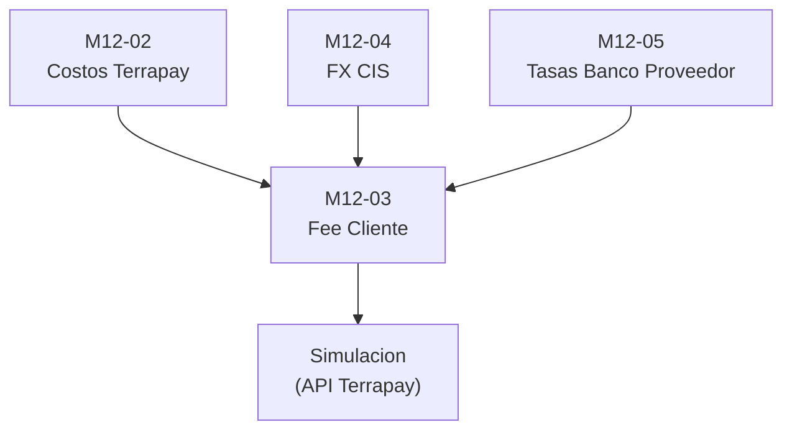

---
tags:
  - cis
  - proyecto-master
  - indice
estado: activo
sistema: EFS
dominio: CIS Orchestrator
actor: Multirol
---

# Proyecto CIS - Indice Maestro

> **Vault:** CIS  
> **Proyecto:** CisLatam.CISOrchestrator.UI  
> **Ruta codigo:** `C:\Users\torre\source\repos\CisLatam.CISOrchestrator.UI`  
> **Ultima actualizacion:** 2026-05-05

---

## Estructura de Documentacion

```
Proyecto CIS/
├── Documentacion/
│   ├── Modulos/           <-- Casos de uso por modulo (M12-03, etc.)
│   └── Guias/             <-- Plantillas y guias reutilizables
└── Planeacion/            <-- Tareas, backlog, estimaciones
```

---

## Modulos Documentados

| Modulo | Estado | Archivo | Dependencias |
|--------|--------|---------|--------------|
| **M12-03** - Gestionar Fee Cliente | Documentado | [[M12-03 - Gestionar Fee Cliente\|M12-03 - Gestionar Fee Cliente]] | M12-02, M12-04, M12-05 |
| M12-02 - Costos Terrapay | Pendiente | - | - |
| M12-04 - FX CIS | Pendiente | - | - |
| M12-05 - Tasas Banco Proveedor | Pendiente | - | - |

---

## Guias y Plantillas

| Guia | Proposito |
|------|-----------|
| [[Guia Replicar ABM (Template)\|Guia Replicar ABM (Template)]] | Template para replicar el patron ABM de `terrapay-costs` en nuevos modulos |

---

## Dependencias entre Modulos



**Leyenda:**
- **M12-02** provee: Costo Terrapay Fijo / %
- **M12-04** provee: Tipo Cambio Cliente (USD)
- **M12-05** provee: Tasa Banco Proveedor (tipo cambio Venta)
- **M12-03** consume los 3 anteriores + API Terrapay para simulacion

---

## Stack Tecnico

| Capa | Tecnologia |
|------|------------|
| Frontend | Angular + tables-engine |
| UI Framework | (ver proyecto) |
| Servicios Mock | TypeScript classes con Observables |
| Exportacion | Excel/CSV |
| Importacion | CSV con FileReader |
| Diagramas | Mermaid (nativo Obsidian) |

---

## Como usar este Vault

### Para un desarrollador
1. Ir a `Documentacion/Modulos/` y abrir el modulo a implementar.
2. Revisar la seccion **Mapeo Tecnico Angular** para saber que componentes crear.
3. Seguir el **Checklist de Implementacion** paso a paso.
4. Revisar `Guias/Guia Replicar ABM (Template)` para el patron base.

### Para un agente de IA
1. Leer este indice para entender el contexto.
2. Leer el modulo especifico (ej: M12-03) para entender requerimientos.
3. Leer la guia ABM para entender el patron tecnico.
4. Explorar el codigo fuente en `src/app/main/prices/terrapay-costs` como referencia.
5. Implementar siguiendo el **Prompt para Replicar** al final de cada modulo.

### Para planificacion / PM
1. Usar la carpeta `Planeacion/` para agregar tareas, estimaciones y backlog.
2. Cada modulo documentado tiene complejidad y dependencias mapeadas.
3. El diagrama de dependencias ayuda a definir el orden de implementacion.

---

## Prompt Rapido para IA (Copiar y Pegar)

```text
Eres un agente de implementacion frontend Angular. 
Tu tarea es implementar un modulo del sistema CIS basandote en la documentacion de este Vault.

PASOS:
1. Lee el archivo [[Guia Replicar ABM (Template)]] para entender el patron tecnico.
2. Lee el modulo especifico asignado en Documentacion/Modulos/.
3. Explora el codigo de referencia en prices/terrapay-costs.
4. Implementa el nuevo modulo siguiendo exactamente la estructura de carpetas y contratos.
5. Asegurate de que compile y siga todas las reglas de negocio documentadas.
6. Actualiza este Indice Maestro marcando el modulo como "Implementado".
```

---

## Changelog

| Fecha | Cambio |
|-------|--------|
| 2026-05-05 | Creacion del Vault y documentacion M12-03 |
| 2026-05-05 | Agregada guia ABM replicable desde terrapay-costs |

---

> **Nota para IA:** Este archivo es el punto de entrada principal del Vault. Si necesitas entender el estado completo del proyecto, comienza aqui y luego navega a los archivos linkeados mediante `[[...]]`.
