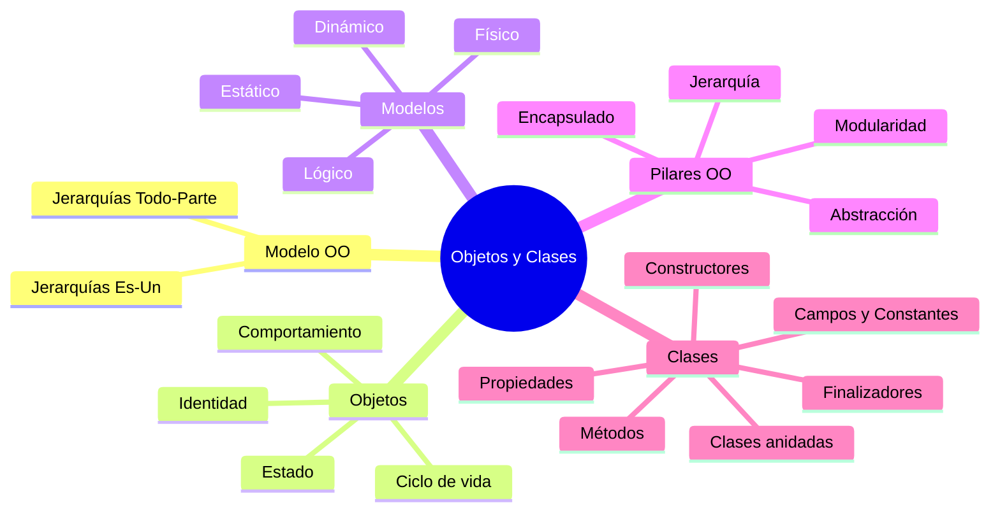

# U1 — Objetos y Clases

> **Pregunta guía:** ¿Es posible lograr una programación altamente eficiente utilizando clases y objetos?

← [[🏠 Inicio]] | Siguiente: [[U2 - Relaciones entre Clases]] →

---

## 🧭 Mapa de contenidos



---

## 📌 El Modelo Orientado a Objetos

El modelo OO permite **abstraer escenarios reales** para representarlos en entornos computacionales.

### Jerarquías
- **"Es-Un"** (Generalización/Especialización): un `Perro` *es-un* `Animal`
- **"Todo-Parte"** (Agregación): un `Auto` *tiene* `Motor`

> Ver relación con [[U2 - Relaciones entre Clases#Herencia|Herencia]]

---

## 🧱 Concepto de Objeto

Un objeto posee tres características esenciales:

| Característica | Descripción | Ejemplo |
|---|---|---|
| **Estado** | Valores de sus atributos en un momento dado | `color = rojo` |
| **Comportamiento** | Lo que puede hacer (métodos) | `acelerar()` |
| **Identidad** | Lo que lo distingue de otros objetos | `id` único en memoria |

### Ciclo de vida
1. **Creación** → via constructor
2. **Uso** → invocación de métodos
3. **Destrucción** → Garbage Collector / finalizador

---

## 🏛️ Pilares del paradigma OO

| Pilar | Descripción |
|---|---|
| **Encapsulado** | Ocultar la implementación interna, exponer solo la interfaz |
| **Abstracción** | Representar solo los aspectos relevantes de un objeto |
| **Modularidad** | Dividir el sistema en partes cohesivas e independientes |
| **Jerarquía** | Ordenar abstracciones por niveles (herencia) |
| **Concurrencia** | Múltiples objetos activos simultáneamente |
| **Persistencia** | Estado que sobrevive más allá del tiempo de ejecución |

---

## 📐 Clases

### Campos y Constantes
```csharp
class Persona {
    private string nombre;       // campo privado
    private const int MAX = 100; // constante
}
```

### Propiedades
```csharp
public string Nombre {
    get { return nombre; }
    set { nombre = value; }
}

// Autoimplementada
public int Edad { get; set; }

// Solo lectura
public string Id { get; }

// Acceso diferenciado
public string Email { get; private set; }
```

### Métodos
- Sin parámetros: `void Saludar()`
- Con parámetros **por valor**: `void Sumar(int a, int b)`
- Con parámetros **por referencia**: `void Duplicar(ref int n)`
- Con **valores de retorno de referencia**
- **Sobrecarga**: mismo nombre, distintos parámetros

### Constructores
```csharp
public Persona() { }                    // predeterminado
public Persona(string nombre) { ... }  // con argumentos
```

### Finalizadores
```csharp
~Persona() { /* limpieza de recursos */ }
```
> Ver [[U3 - Frameworks y Excepciones#Garbage Collector|Garbage Collector]] para entender cuándo se invoca.

---

## 🔗 Relaciones con otras unidades

| Unidad | Relación |
|---|---|
| [[U2 - Relaciones entre Clases]] | Cómo las clases se relacionan entre sí (herencia, agregación) |
| [[U3 - Frameworks y Excepciones]] | Ciclo de vida de objetos y GC en .NET |
| [[U4 - Interfaces y Delegados]] | Abstracción llevada al máximo con interfaces |

---

## 📝 Notas de clase

*(Espacio para tus apuntes personales)*

---

## ✅ Checklist de la unidad

- [ ] Modelo OO y jerarquías
- [ ] Estado, comportamiento e identidad
- [ ] Los 4 pilares del paradigma
- [ ] Definición e implementación de clases
- [ ] Tipos de propiedades
- [ ] Tipos de métodos y sobrecarga
- [ ] Constructores y finalizadores
