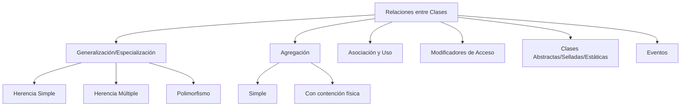

# U2 — Objetos y Clases: Relaciones

> **Pregunta guía:** ¿Cómo se puede aprovechar la potencia de un lenguaje orientado a objetos?

← [[U1 - Objetos y Clases]] | Siguiente: [[U3 - Frameworks y Excepciones]] →

---

## 🧭 Mapa de contenidos



---

## 🔑 Modificadores de Acceso

| Modificador | Accesible desde |
|---|---|
| `public` | Cualquier lugar |
| `private` | Solo la clase que lo define |
| `protected` | Clase y sus derivadas |
| `internal` | Mismo ensamblado |
| `protected internal` | Mismo ensamblado o clases derivadas |

---

## 🏛️ Tipos de Clases Especiales

### Clase Abstracta
- No se puede instanciar directamente
- Puede tener métodos abstractos (sin implementación) y concretos
```csharp
abstract class Figura {
    public abstract double Area(); // debe implementarse en derivadas
    public void Dibujar() { ... }  // implementación concreta
}
```

### Clase Sellada (`sealed`)
- No puede ser heredada
```csharp
sealed class ConfiguracionApp { ... }
```

### Clase Estática
- Solo miembros estáticos — no se instancia
```csharp
static class Utilidades {
    public static int Sumar(int a, int b) => a + b;
}
```

---

## 🔗 Relaciones entre Clases

### 1. Generalización–Especialización (Herencia)

**Herencia simple** — una clase derivada hereda de una clase base:
```csharp
class Animal { public void Respirar() { } }
class Perro : Animal { public void Ladrar() { } }
```

**Herencia múltiple** — en C# se logra mediante [[U4 - Interfaces y Delegados|Interfaces]]:
```csharp
class Anfibio : Animal, INavegable { }
```

**Acceso a la clase base:**
```csharp
class Perro : Animal {
    public Perro() : base() { }   // constructor base
    public override string ToString() => base.ToString() + " (perro)";
}
```

### 2. Polimorfismo
Métodos virtuales y sobreescritura:
```csharp
class Animal {
    public virtual string HacerSonido() => "...";
}
class Gato : Animal {
    public override string HacerSonido() => "Miau";
}
```

> Relacionado con [[U4 - Interfaces y Delegados|Interfaces]] — otra forma de polimorfismo

### 3. Agregación
- **Simple**: el objeto hijo puede existir sin el padre
- **Con contención física (Composición)**: el objeto hijo no existe sin el padre

```csharp
// Agregación simple
class Departamento {
    public List<Empleado> Empleados { get; set; } // Empleado existe sin Departamento
}

// Composición
class Casa {
    private Habitacion[] habitaciones; // Habitación no existe sin Casa
    public Casa() { habitaciones = new Habitacion[3]; }
}
```

### 4. Asociación y Relación de Uso
- **Asociación**: relación estructural duradera entre clases
- **Uso (Dependencia)**: una clase usa temporalmente a otra (parámetro, variable local)

---

## ⚡ Eventos

### Suscripción y publicación
```csharp
// Declarar
public event EventHandler BotonPresionado;

// Suscribir (mediante programación)
boton.BotonPresionado += MiMetodoHandler;

// Suscribir con método anónimo
boton.BotonPresionado += (sender, e) => Console.WriteLine("¡Presionado!");

// Desencadenar
BotonPresionado?.Invoke(this, EventArgs.Empty);
```

> Los eventos usan [[U4 - Interfaces y Delegados#Delegados|Delegados]] internamente

---

## 📊 Calidad de una Clase

| Elemento | Descripción |
|---|---|
| **Acoplamiento** | Grado de dependencia con otras clases (bajo = mejor) |
| **Cohesión** | Qué tan relacionadas están las responsabilidades (alta = mejor) |
| **Suficiencia** | Tiene todo lo necesario para su abstracción |
| **Compleción** | Captura todos los aspectos relevantes |
| **Primitivas** | Los métodos hacen solo operaciones elementales |

---

## 🔗 Teoría de Tipos

- **Tipos anónimos**: tipos sin nombre definido explícitamente
```csharp
var persona = new { Nombre = "Juan", Edad = 30 };
```
> Se relaciona con [[U5 - Genericos LINQ Lambda#LINQ|LINQ to Objects]]

---

## 📝 Notas de clase

*(Espacio para tus apuntes personales)*

---

## ✅ Checklist de la unidad

- [ ] Modificadores de acceso
- [ ] Clases abstractas, selladas y estáticas
- [ ] Herencia simple y múltiple
- [ ] Polimorfismo y métodos virtuales
- [ ] Agregación simple vs. composición
- [ ] Asociación y uso
- [ ] Eventos (suscripción y publicación)
- [ ] Criterios de calidad de una clase
