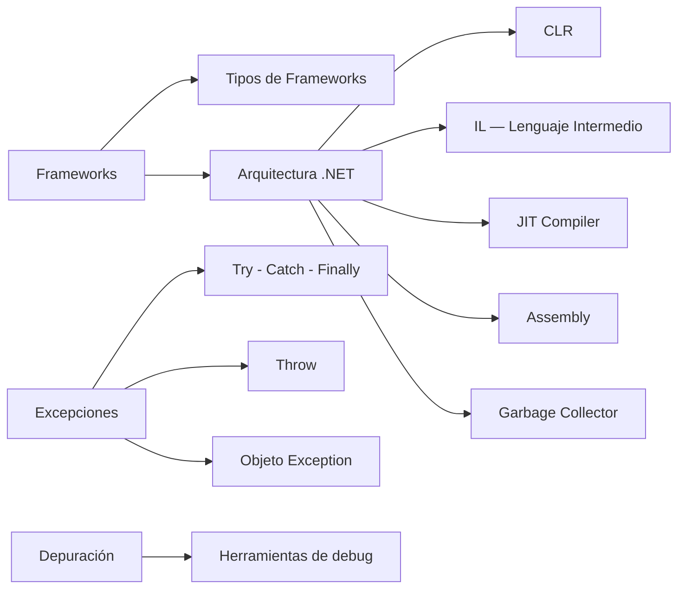

# U3 — Frameworks y Manejo de Excepciones

> **Pregunta guía:** ¿Cómo las arquitecturas de software afectan su desarrollo?

← [[U2 - Relaciones entre Clases]] | Siguiente: [[U4 - Interfaces y Delegados]] →

---

## 🧭 Mapa de contenidos



---

## 🏗️ Concepto de Framework

Un framework es una **estructura de soporte** que define cómo construir y organizar un software.

| Elemento | Descripción |
|---|---|
| Clases base | Componentes reutilizables |
| Convenciones | Normas que guían el desarrollo |
| Librerías | Código predefinido listo para usar |
| Herramientas | Compiladores, depuradores, etc. |

**Tipos de frameworks**: de aplicación, de pruebas, web, de UI, entre otros.

---

## ⚙️ Arquitectura .NET

```
Tu código fuente (.cs)
        ↓ Compilador C#
  Lenguaje Intermedio (IL / MSIL)
        ↓ JIT Compiler (en tiempo de ejecución)
    Código nativo (binario)
        ↓
   Ejecución por el CLR
```

### Common Language Runtime (CLR)
El CLR es el **motor de ejecución** de .NET. Sus responsabilidades:
- Administración de memoria
- Seguridad de tipos
- Manejo de excepciones
- Compilación JIT
- Interoperabilidad COM

### Lenguaje Intermedio (IL)
- El compilador C# no genera código nativo directamente
- Genera **IL (Intermediate Language)**, independiente de la plataforma
- El JIT lo convierte a código nativo en tiempo de ejecución

### Compilador Just-in-Time (JIT)
- Convierte IL a código máquina **en el momento de la ejecución**
- Solo compila lo que se usa → eficiencia
- Almacena en caché el código compilado

### Assembly
- Unidad de despliegue en .NET (`.dll` o `.exe`)
- Contiene: IL, metadatos, manifiesto, recursos
- Dos tipos: **privados** (una app) y **compartidos** (GAC)

### Garbage Collector (GC)
- Administra automáticamente la memoria en el *heap*
- Detecta objetos sin referencias y los libera
- Generaciones: **Gen 0** (objetos nuevos), **Gen 1**, **Gen 2** (objetos de larga vida)

> Ver ciclo de vida en [[U1 - Objetos y Clases#Ciclo de vida|Ciclo de vida del objeto]]

### Interoperatividad .NET y COM
- Permite usar componentes COM desde .NET (y viceversa)
- **Código administrado**: ejecutado bajo el control del CLR
- **Código no administrado**: nativo, sin control del CLR (ej: Win32 API)

---

## 🚨 Manejo de Excepciones

### Estructura básica
```csharp
try {
    // código que puede fallar
    int resultado = 10 / divisor;
}
catch (DivideByZeroException ex) {
    Console.WriteLine($"Error: {ex.Message}");
}
catch (Exception ex) {
    // captura genérica — siempre al final
    Console.WriteLine($"Error inesperado: {ex.Message}");
}
finally {
    // SIEMPRE se ejecuta (con o sin excepción)
    // ideal para liberar recursos
}
```

### El objeto `Exception`

| Propiedad | Descripción |
|---|---|
| `Message` | Descripción del error |
| `StackTrace` | Pila de llamadas al momento del error |
| `InnerException` | Excepción que originó la actual |
| `Source` | Nombre del ensamblado que lanzó la excepción |

### Lanzar excepciones (`throw`)
```csharp
// Lanzar nueva
throw new ArgumentException("El valor no puede ser negativo");

// Re-lanzar (preserva stack trace)
catch (Exception ex) {
    throw; // sin argumentos — re-lanza la misma
}

// Encadenar excepciones
throw new ApplicationException("Error de aplicación", ex);
```

---

## 🔍 Depuración

Herramientas disponibles en Visual Studio:
- **Breakpoints** — puntos de interrupción
- **Watch / Locals** — inspección de variables
- **Call Stack** — pila de llamadas
- **Immediate Window** — evaluación de expresiones en tiempo de depuración
- **Step Over / Into / Out** — control paso a paso

---

## 🔗 Relaciones con otras unidades

| Unidad | Relación |
|---|---|
| [[U1 - Objetos y Clases]] | El GC maneja el ciclo de vida de los objetos creados en U1 |
| [[U4 - Interfaces y Delegados]] | Las interfaces del framework (IDisposable) ayudan a liberar recursos |
| [[U6 - Comunicacion entre Aplicaciones]] | Las conexiones de red siempre deben manejarse con try-catch-finally |

---

## 📝 Notas de clase

*(Espacio para tus apuntes personales)*

---

## ✅ Checklist de la unidad

- [ ] Concepto y tipos de frameworks
- [ ] Arquitectura .NET (CLR, IL, JIT, Assembly)
- [ ] Código administrado vs. no administrado
- [ ] Garbage Collector y generaciones
- [ ] Try – Catch – Finally
- [ ] Objeto Exception y sus propiedades
- [ ] Instrucción Throw y encadenamiento
- [ ] Herramientas de depuración
