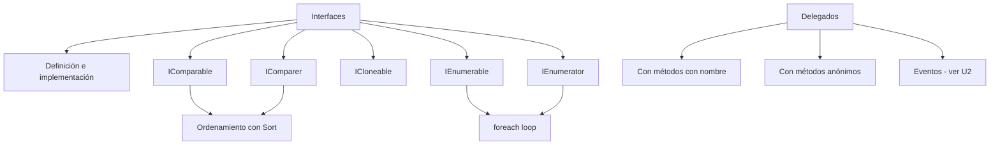

# U4 — Interfaces y Delegados

> **Pregunta guía:** ¿Qué elementos potencian la programación OO?

← [[U3 - Frameworks y Excepciones]] | Siguiente: [[U5 - Genericos LINQ Lambda]] →

---

## 🧭 Mapa de contenidos



---

## 🎭 Interfaces

Una interfaz define un **contrato**: qué métodos y propiedades debe implementar una clase, sin especificar *cómo*.

```csharp
// Definición
interface IFigura {
    double Area();
    double Perimetro();
    string Nombre { get; }
}

// Implementación
class Circulo : IFigura {
    public double Radio { get; set; }
    public double Area() => Math.PI * Radio * Radio;
    public double Perimetro() => 2 * Math.PI * Radio;
    public string Nombre => "Círculo";
}
```

**Diferencia con clase abstracta:**

| Aspecto | Interfaz | Clase Abstracta |
|---|---|---|
| Implementación | No (solo contrato) | Puede tener métodos concretos |
| Herencia múltiple | ✅ Sí | ❌ No (una sola) |
| Campos | ❌ No | ✅ Sí |
| Constructor | ❌ No | ✅ Sí |

> Relación con [[U2 - Relaciones entre Clases#Polimorfismo|Polimorfismo]] — las interfaces son otra forma de lograrlo

---

## 📚 Interfaces del Framework .NET

### `IComparable` — Orden natural
Permite ordenar objetos con `Array.Sort()` o `List.Sort()`:
```csharp
class Producto : IComparable<Producto> {
    public double Precio { get; set; }
    public int CompareTo(Producto otro) {
        return this.Precio.CompareTo(otro.Precio);
    }
}
```

### `IComparer` — Orden personalizado
Permite definir criterios de orden externos:
```csharp
class OrdenarPorNombre : IComparer<Producto> {
    public int Compare(Producto x, Producto y) {
        return string.Compare(x.Nombre, y.Nombre);
    }
}
// Uso: lista.Sort(new OrdenarPorNombre());
```

### `ICloneable` — Clonación
```csharp
class Persona : ICloneable {
    public string Nombre { get; set; }
    public object Clone() {
        return new Persona { Nombre = this.Nombre }; // copia superficial
    }
}
```

> ⚠️ `ICloneable` solo garantiza que existe un `Clone()` — no especifica si es copia profunda o superficial.

### `IEnumerable` e `IEnumerator` — Iteración
Permiten usar `foreach` sobre colecciones personalizadas:
```csharp
class MiColeccion : IEnumerable<int> {
    private int[] datos = { 1, 2, 3 };
    public IEnumerator<int> GetEnumerator() {
        foreach (var d in datos) yield return d;
    }
    IEnumerator IEnumerable.GetEnumerator() => GetEnumerator();
}
// Uso: foreach (var n in miColeccion) { ... }
```

> Relacionado con [[U5 - Genericos LINQ Lambda#LINQ|LINQ]] — LINQ trabaja sobre `IEnumerable<T>`

---

## 📬 Delegados

Un delegado es un **tipo que referencia a métodos**. Define la firma que debe tener el método referenciado.

```csharp
// Declarar un tipo delegado
delegate int Operacion(int a, int b);

// Método que cumple la firma
static int Sumar(int a, int b) => a + b;

// Asignar y usar
Operacion op = Sumar;
Console.WriteLine(op(3, 4)); // → 7
```

### Delegados con métodos con nombre
```csharp
Operacion op = new Operacion(Sumar); // forma explícita
Operacion op2 = Sumar;               // forma simplificada
```

### Delegados con métodos anónimos
```csharp
// Método anónimo (sintaxis antigua)
Operacion op = delegate(int a, int b) { return a + b; };

// Expresión lambda (sintaxis moderna)
Operacion op2 = (a, b) => a + b;
```

> Ver [[U5 - Genericos LINQ Lambda#Expresiones Lambda|Expresiones Lambda]] para profundizar

### Delegados predefinidos en .NET
```csharp
// Func<T>: retorna un valor
Func<int, int, int> suma = (a, b) => a + b;

// Action<T>: no retorna nada (void)
Action<string> imprimir = msg => Console.WriteLine(msg);

// Predicate<T>: retorna bool
Predicate<int> esPar = n => n % 2 == 0;
```

### Multicast — encadenamiento
```csharp
Operacion op = Sumar;
op += Restar; // agrega método
op -= Restar; // quita método
```

> Los **Eventos** de [[U2 - Relaciones entre Clases#Eventos|U2]] están basados en delegados

---

## 🔗 Relaciones con otras unidades

| Unidad | Relación |
|---|---|
| [[U2 - Relaciones entre Clases#Eventos]] | Los eventos usan delegados internamente |
| [[U2 - Relaciones entre Clases#Polimorfismo]] | Interfaces como forma de polimorfismo |
| [[U5 - Genericos LINQ Lambda]] | LINQ usa `IEnumerable<T>`; lambdas son delegados |

---

## 📝 Notas de clase

*(Espacio para tus apuntes personales)*

---

## ✅ Checklist de la unidad

- [ ] Concepto e implementación de interfaces
- [ ] Diferencia entre interfaz y clase abstracta
- [ ] IComparable — orden natural
- [ ] IComparer — orden personalizado
- [ ] ICloneable — clonación superficial y profunda
- [ ] IEnumerable e IEnumerator — iteración personalizada
- [ ] Delegados con métodos con nombre
- [ ] Delegados con métodos anónimos
- [ ] Func, Action y Predicate
- [ ] Delegados multicast
