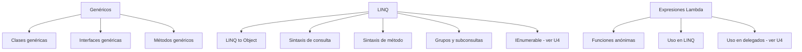

# U5 — Genéricos, LINQ y Expresiones Lambda

> **Pregunta guía:** ¿Se puede gestionar eficientemente las excepciones de un SI?

← [[U4 - Interfaces y Delegados]] | Siguiente: [[U6 - Comunicacion entre Aplicaciones]] →

---

## 🧭 Mapa de contenidos



---

## 🧬 Genéricos

Los genéricos permiten crear clases, interfaces y métodos que trabajan con **cualquier tipo**, sin perder seguridad de tipos.

### Sin genéricos (problema)
```csharp
// ArrayList acepta object → pérdidas de tipo, boxing/unboxing
ArrayList lista = new ArrayList();
lista.Add(42);
lista.Add("texto"); // ¡mezcla tipos sin error de compilación!
int n = (int)lista[0]; // requiere cast
```

### Con genéricos (solución)
```csharp
List<int> numeros = new List<int>();
numeros.Add(42);
// numeros.Add("texto"); // ❌ error de compilación — ¡correcto!
int n = numeros[0]; // sin cast
```

### Ventajas
- **Seguridad de tipos** en tiempo de compilación
- **Reutilización** del código
- **Rendimiento** — evita boxing/unboxing

### Clase genérica
```csharp
class Pila<T> {
    private T[] elementos;
    private int tope = 0;
    public Pila(int capacidad) { elementos = new T[capacidad]; }
    public void Push(T item) { elementos[tope++] = item; }
    public T Pop() { return elementos[--tope]; }
}

// Uso
var pilaInt = new Pila<int>(10);
var pilaStr = new Pila<string>(5);
```

### Interfaz genérica
```csharp
interface IRepositorio<T> {
    void Agregar(T entidad);
    T ObtenerPorId(int id);
    IEnumerable<T> ObtenerTodos();
}
```
> Relacionado con [[U4 - Interfaces y Delegados#IEnumerable|IEnumerable]]

### Método genérico
```csharp
static T Maximo<T>(T a, T b) where T : IComparable<T> {
    return a.CompareTo(b) >= 0 ? a : b;
}
// Uso
int max = Maximo(3, 7);
string mayor = Maximo("Ana", "Beto");
```

### Restricciones (`where`)
| Restricción | Significado |
|---|---|
| `where T : class` | T debe ser tipo referencia |
| `where T : struct` | T debe ser tipo valor |
| `where T : new()` | T debe tener constructor sin parámetros |
| `where T : IComparable<T>` | T debe implementar esa interfaz |

---

## 🔍 LINQ (Language Integrated Query)

LINQ permite realizar **consultas sobre colecciones** directamente en C#, similar a SQL.

### Dos sintaxis equivalentes

**Sintaxis de consulta** (similar a SQL):
```csharp
var resultado = from p in productos
                where p.Precio > 100
                orderby p.Nombre
                select p;
```

**Sintaxis de método** (fluent / lambda):
```csharp
var resultado = productos
    .Where(p => p.Precio > 100)
    .OrderBy(p => p.Nombre);
```

### Operadores LINQ comunes
| Operador | Descripción | Ejemplo |
|---|---|---|
| `Where` | Filtrar | `.Where(x => x.Edad > 18)` |
| `Select` | Proyectar/transformar | `.Select(x => x.Nombre)` |
| `OrderBy` / `OrderByDescending` | Ordenar | `.OrderBy(x => x.Edad)` |
| `GroupBy` | Agrupar | `.GroupBy(x => x.Ciudad)` |
| `First` / `FirstOrDefault` | Primer elemento | `.First(x => x.Id == 1)` |
| `Count` | Contar | `.Count(x => x.Activo)` |
| `Sum` / `Average` | Agregación | `.Sum(x => x.Precio)` |
| `Any` / `All` | Verificar condición | `.Any(x => x.Stock > 0)` |
| `ToList` / `ToArray` | Materializar | `.ToList()` |

### Almacenar resultados
```csharp
// Ejecución diferida (no se ejecuta hasta iterar)
IEnumerable<Producto> consulta = productos.Where(p => p.Precio > 50);

// Ejecución inmediata
List<Producto> lista = productos.Where(p => p.Precio > 50).ToList();
```

### Grupos anidados y subconsultas
```csharp
var porCategoria = from p in productos
                   group p by p.Categoria into grupo
                   select new {
                       Categoria = grupo.Key,
                       Total = grupo.Sum(p => p.Precio),
                       Items = grupo.ToList()
                   };
```

---

## λ Expresiones Lambda

Las lambdas son **funciones anónimas** con sintaxis compacta.

```csharp
// Sintaxis: (parámetros) => expresión o { bloque }
Func<int, int> doble = x => x * 2;
Func<int, int, int> suma = (a, b) => a + b;
Action<string> imprimir = msg => Console.WriteLine(msg);
Predicate<int> esPar = n => { return n % 2 == 0; };
```

### Lambdas como delegados
```csharp
// Lambda como Func
Func<string, int> longitud = s => s.Length;

// Lambda en método que espera delegado
lista.Sort((a, b) => a.Nombre.CompareTo(b.Nombre));
```

### Lambdas en LINQ
```csharp
var mayores = personas
    .Where(p => p.Edad >= 18)          // Predicate
    .Select(p => new { p.Nombre, p.Edad }) // transformación
    .OrderByDescending(p => p.Edad);   // criterio de orden
```

> Ver [[U4 - Interfaces y Delegados#Delegados|Delegados]] — las lambdas son una forma compacta de delegados

---

## 🔗 Relaciones con otras unidades

| Unidad | Relación |
|---|---|
| [[U4 - Interfaces y Delegados#IEnumerable]] | LINQ opera sobre `IEnumerable<T>` |
| [[U4 - Interfaces y Delegados#Delegados]] | Las lambdas son azúcar sintáctico sobre delegados |
| [[U2 - Relaciones entre Clases#Teoría de Tipos]] | Los tipos anónimos aparecen frecuentemente en `select` de LINQ |

---

## 📝 Notas de clase

*(Espacio para tus apuntes personales)*

---

## ✅ Checklist de la unidad

- [ ] Ventajas de los genéricos
- [ ] Clases genéricas
- [ ] Interfaces y métodos genéricos
- [ ] Restricciones con `where`
- [ ] LINQ — sintaxis de consulta
- [ ] LINQ — sintaxis de método (fluent)
- [ ] Operadores LINQ principales
- [ ] Ejecución diferida vs. inmediata
- [ ] Grupos anidados y subconsultas
- [ ] Expresiones lambda básicas
- [ ] Lambdas en contextos de delegados
