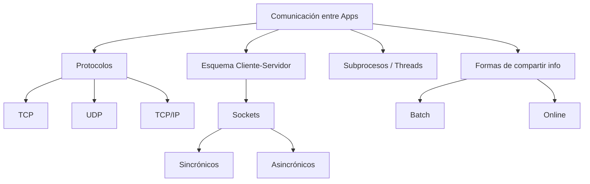

# U6 — Comunicación entre Aplicaciones y Manejo de Dispositivos

> **Pregunta guía:** ¿Cómo puedo comunicar aplicaciones y actuar sobre dispositivos?

← [[U5 - Genericos LINQ Lambda]] | ← [[🏠 Inicio]]

---

## 🧭 Mapa de contenidos



---

## 🖧 Esquema Cliente–Servidor

| Rol | Descripción |
|---|---|
| **Servidor** | Espera conexiones, provee servicios, siempre activo |
| **Cliente** | Inicia la conexión, consume servicios |

### Ventajas
- Centralización de datos y lógica
- Escalabilidad
- Mantenimiento simplificado

### Desventajas
- Punto único de falla (el servidor)
- Cuello de botella bajo alta demanda
- Costo de infraestructura

### Formas de compartir información
| Modalidad | Descripción | Ejemplo |
|---|---|---|
| **Batch** | Se envía/procesa en lotes, no en tiempo real | Importación nocturna de datos |
| **Online (en línea)** | Comunicación en tiempo real, continua | Chat, videollamada |

---

## 📡 Protocolos de Comunicación

### TCP (Transmission Control Protocol)
- **Orientado a conexión** — se establece una sesión antes de enviar datos
- **Confiable** — garantiza entrega y orden de los paquetes
- Más lento pero seguro
- Ideal para: transferencia de archivos, web (HTTP), email

### UDP (User Datagram Protocol)
- **Sin conexión** — envía datos sin establecer sesión
- **No confiable** — no garantiza entrega ni orden
- Más rápido pero puede perder paquetes
- Ideal para: streaming, videojuegos en tiempo real, DNS

### TCP/IP
- **IP**: direccionamiento y enrutamiento de paquetes
- **TCP/IP**: combinación que forma la base de Internet
- Direcciones IP identifican equipos en la red
- Puertos identifican aplicaciones en un equipo

---

## 🔌 Sockets

Un socket es un **endpoint de comunicación** que combina dirección IP + puerto.

```
Cliente                          Servidor
[IP:puerto_efímero] ←———————→ [IP:puerto_fijo]
       Socket                      Socket
```

### Socket de Cliente Sincrónico
```csharp
using System.Net.Sockets;

// Conectar
TcpClient cliente = new TcpClient();
cliente.Connect("127.0.0.1", 8080);

// Obtener stream
NetworkStream stream = cliente.GetStream();

// Enviar
byte[] datos = Encoding.UTF8.GetBytes("Hola servidor");
stream.Write(datos, 0, datos.Length);

// Recibir
byte[] buffer = new byte[1024];
int bytesLeidos = stream.Read(buffer, 0, buffer.Length);
string respuesta = Encoding.UTF8.GetString(buffer, 0, bytesLeidos);

cliente.Close();
```

### Socket de Servidor Sincrónico
```csharp
TcpListener servidor = new TcpListener(IPAddress.Any, 8080);
servidor.Start();

TcpClient clienteConectado = servidor.AcceptTcpClient(); // bloqueante
NetworkStream stream = clienteConectado.GetStream();
// leer / escribir...
```

### Diferencia Sincrónico vs. Asincrónico

| Aspecto | Sincrónico | Asincrónico |
|---|---|---|
| Espera | Bloquea el hilo hasta completar | No bloquea — continúa ejecutando |
| Rendimiento | Menor bajo alta concurrencia | Mayor — maneja muchos clientes |
| Complejidad | Simple | Mayor (async/await, callbacks) |
| Uso | Aplicaciones simples | Servidores de producción |

### Sockets Asincrónicos (con async/await)
```csharp
async Task ManejarClienteAsync(TcpClient cliente) {
    NetworkStream stream = cliente.GetStream();
    byte[] buffer = new byte[1024];
    int bytes = await stream.ReadAsync(buffer, 0, buffer.Length);
    string mensaje = Encoding.UTF8.GetString(buffer, 0, bytes);
    // procesar...
}
```

---

## 🧵 Subprocesos (Threads)

Permiten ejecutar múltiples tareas de forma **concurrente** dentro de una misma aplicación.

```csharp
// Crear y lanzar un hilo
Thread hilo = new Thread(() => {
    Console.WriteLine("Ejecutando en otro hilo");
});
hilo.Start();

// Task (forma moderna, recomendada)
Task tarea = Task.Run(() => ProcesarDatos());
await tarea;
```

> Relacionado con el pilar de **Concurrencia** visto en [[U1 - Objetos y Clases#Pilares del paradigma OO|U1 — Pilares OO]]

---

## 🛡️ Manejo de errores en red

Siempre envolver operaciones de red con manejo de excepciones:
```csharp
try {
    cliente.Connect("servidor.com", 80);
}
catch (SocketException ex) {
    Console.WriteLine($"Error de socket: {ex.SocketErrorCode}");
}
catch (IOException ex) {
    Console.WriteLine($"Error de IO: {ex.Message}");
}
finally {
    cliente?.Close(); // liberar siempre el recurso
}
```
> Ver [[U3 - Frameworks y Excepciones#Manejo de Excepciones|Try-Catch-Finally en U3]]

---

## 🔗 Relaciones con otras unidades

| Unidad | Relación |
|---|---|
| [[U1 - Objetos y Clases#Pilares del paradigma OO]] | La concurrencia es un pilar del paradigma OO |
| [[U3 - Frameworks y Excepciones#Manejo de Excepciones]] | Las conexiones de red SIEMPRE necesitan manejo de excepciones |
| [[U4 - Interfaces y Delegados]] | Los callbacks asincrónicos usan delegados |

---

## 📝 Notas de clase

*(Espacio para tus apuntes personales)*

---

## ✅ Checklist de la unidad

- [ ] Esquema cliente–servidor (ventajas y desventajas)
- [ ] Batch vs. Online
- [ ] Protocolo TCP vs. UDP
- [ ] Concepto de socket (IP + puerto)
- [ ] Socket de cliente sincrónico
- [ ] Socket de servidor sincrónico
- [ ] Diferencia sincrónico vs. asincrónico
- [ ] Sockets asincrónicos con async/await
- [ ] Subprocesos / Threads básicos
- [ ] Manejo de excepciones en comunicaciones de red
